# Paixueji System Architecture

> **Learning by Asking** - An AI-powered educational conversation system for children ages 3-8

## Table of Contents
1. [System Overview](#system-overview)
2. [User Interaction Flows](#user-interaction-flows)
3. [Focus Modes & Decision Logic](#focus-modes--decision-logic)
4. [State Management](#state-management)
5. [AI Decision Points](#ai-decision-points)
6. [Technical Architecture](#technical-architecture)
7. [Extension Guide](#extension-guide)

---

## System Overview

### What is Paixueji?

Paixueji is an interactive educational system where an AI assistant asks questions about everyday objects to help children (ages 3-8) develop observation and critical thinking skills. Unlike traditional Q&A systems where users ask questions, **the AI asks and the child answers**.

### Core Capabilities

- **Age-Adaptive Questioning**: Adjusts question complexity (WHAT/HOW/WHY) based on child's age
- **Focus Mode Strategies**: Four exploration strategies (depth, width by color/shape/category)
- **Dynamic Topic Switching**: Seamlessly transitions to new objects children mention
- **Real-Time Streaming**: SSE-based streaming for natural conversation flow
- **Multi-Layer Prompting**: Sophisticated prompt composition for context-aware responses

### Technology Stack

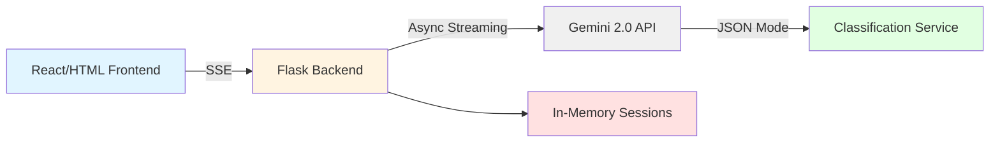

**Key Components:**
- **Frontend**: Vanilla JS with SSE event handling
- **Backend**: Flask with async/await streaming
- **AI**: Google Gemini 2.0 (VertexAI)
- **State**: In-memory session storage (Redis-ready)

---

## User Interaction Flows

### 1. Starting a Conversation

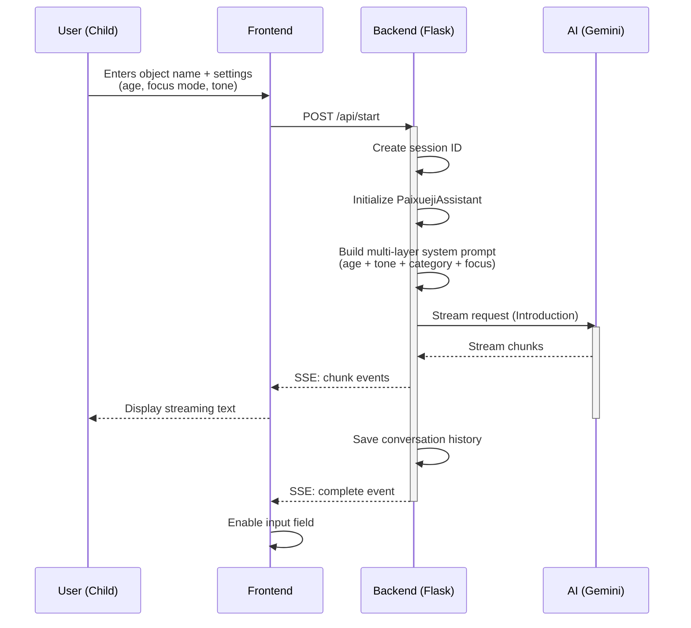

**What Happens:**
1. User fills out form (object name, age, focus mode, tone)
2. Backend validates input and creates unique session
3. System builds context-aware prompts from 5 layers:
   - Base system instructions
   - Age-specific guidance (3-4 / 5-6 / 7-8)
   - Tone style (friendly, excited, teacher, etc.)
   - Category context (if object classified)
   - Focus strategy (depth or width exploration)
4. AI generates first question using streaming
5. Conversation begins!

### 2. Continuing the Conversation

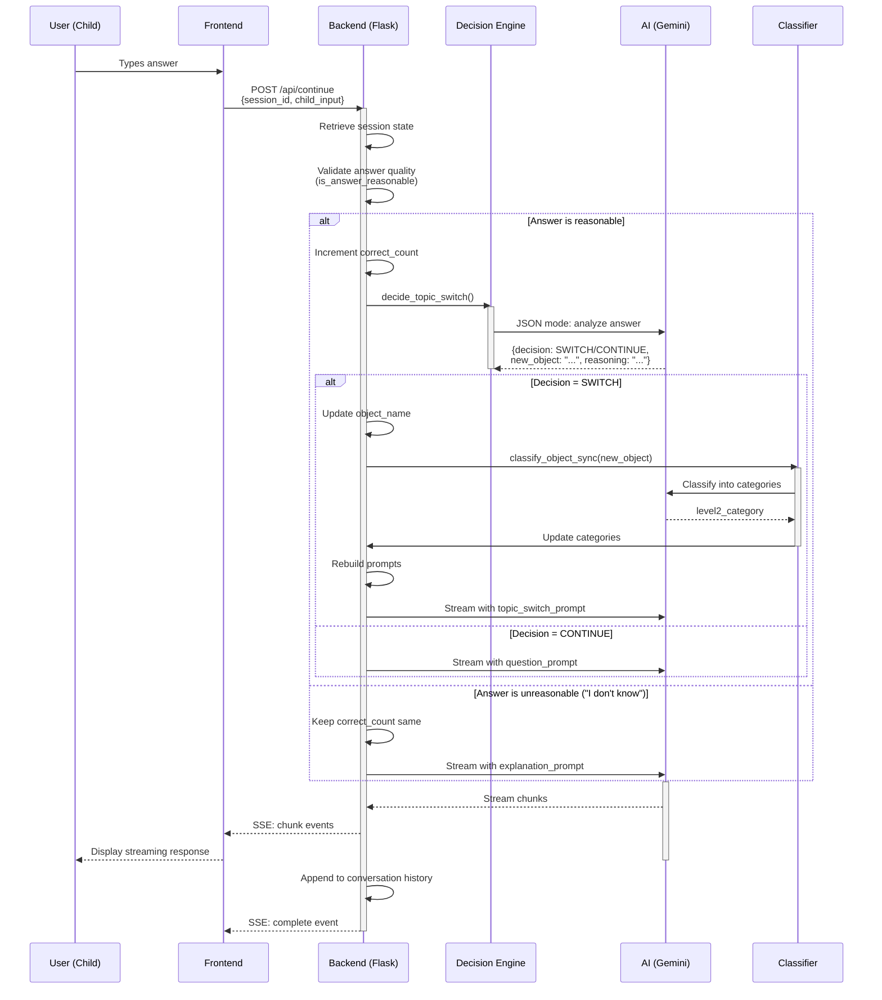

**Key Decision Points:**
1. **Answer Validation**: Is the child's answer reasonable?
   - ✅ Reasonable → Celebrate + Continue
   - ❌ Unreasonable → Explain + Teach
2. **Topic Switch Detection**: Did child mention a new object?
   - Uses structured JSON output (100% reliable)
   - Classifies new object in background (1s timeout)
3. **Response Type Selection**:
   - Follow-up question (normal flow)
   - Topic switch celebration (new object)
   - Explanation + example (child stuck)

### 3. Topic Switching Scenarios

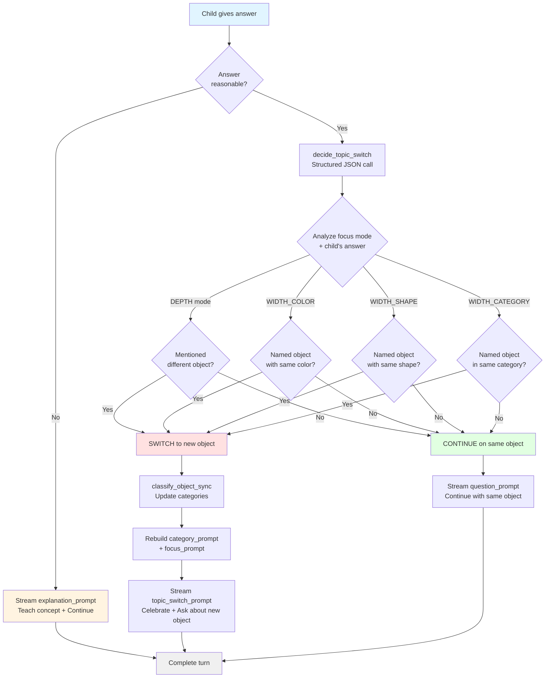

---

## Focus Modes & AI-Driven Topic Switching

### Focus Mode vs Switching Logic (Separation of Concerns)

**Focus modes** and **topic switching** are now **decoupled**:

| Concern | What It Controls | Examples |
|---------|------------------|----------|
| **Focus Mode** | Question style (HOW to ask) | DEPTH: "What are the parts?", WIDTH_COLOR: "What else is red?" |
| **Topic Switching** | When to switch topics (WHEN to switch) | AI analyzes conversation context, not hardcoded rules |

### Focus Mode Strategies

Each focus mode defines **question style only** (not switching behavior):

| Focus Mode | Question Style | Example Questions |
|------------|----------------|-------------------|
| **depth** | Deep dive into current object | "What are its parts?", "How does it work?", "What is it made of?" |
| **width_color** | Explore objects by shared color | "What else is red?", "Can you name another yellow thing?" |
| **width_shape** | Explore objects by shared shape | "What else is round?", "Can you think of something long like this?" |
| **width_category** | Explore objects in same category | "What other fruits do you know?", "Name another animal!" |

### AI-Driven Topic Switching (No Hardcoded Rules!)

Instead of rigid rules, the AI analyzes **conversation context** to decide when to switch:

#### Context Provided to AI:
1. **Last model question** - What did the model just ask?
2. **Child's answer** - How did the child respond?
3. **Current object** - What are we discussing?
4. **Focus mode** - For informational context only

#### Decision Guidelines (Not Rules):
1. **Invited Object Naming**: If AI asked child to name new object and they did → SWITCH
2. **Off-Topic Response**: If child answered with different object instead of answering question → SWITCH
3. **Explicit Request**: If child says "let's talk about X" → SWITCH
4. **Comparison Mention**: If child mentions object in passing ("red like cherry") → CONTINUE
5. **Normal Answer**: If child answered the question → CONTINUE
6. **Stuck/Uncertain**: If child says "I don't know" → CONTINUE

#### Example Decision Scenarios:

| Last Question | Child Answer | AI Decision | Reasoning |
|--------------|--------------|-------------|-----------|
| "What color is the apple?" | "red" | **CONTINUE** | Direct answer, no topic change |
| "Can you name another red fruit?" | "strawberry" | **SWITCH** | Invited naming, child responded |
| "What shape is it?" | "banana" | **SWITCH** | Off-topic, child wants to discuss banana |
| "What does it taste like?" | "sweet like candy" | **CONTINUE** | Comparison, not topic change request |
| "Where do apples grow?" | "Can we talk about dogs?" | **SWITCH** | Explicit request |

### Decision Algorithm (Contextual + Structured Output)

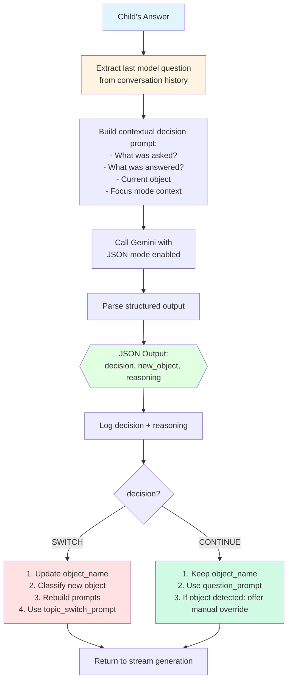

**Why AI-Driven (Not Hardcoded)?**
- ✅ **Natural**: Mimics how human teachers decide
- ✅ **Context-Aware**: Considers what was asked vs what was answered
- ✅ **Flexible**: Handles edge cases and nuanced scenarios
- ✅ **Transparent**: AI explains every decision
- ✅ **Fast**: Same ~100-200ms latency (1 API call)
- ✅ **User Control**: Manual override available

### Manual Override Feature

When AI detects an object but decides to CONTINUE, users can override:

**UI Panel Appears When:**
- AI detected object in child's answer (e.g., "cherry")
- AI decided to CONTINUE (e.g., "Mentioned as comparison, not topic change")

**User Options:**
1. **Switch to [detected_object]** - Force topic change
2. **Stay on current topic** - Dismiss panel and continue

**Backend Flow:**
1. Frontend calls `/api/force-switch` with detected object
2. Backend updates `assistant.object_name`
3. Backend classifies new object (1s timeout)
4. System message appears: "✨ Switched to cherry!"

### Focus Prompt Examples (Updated)

**Depth Mode:**
```
Focus Strategy: DEPTH.
Ask detailed questions about {object_name}'s specific features,
parts, materials, texture, uses, and functionality.
Dive deep into this one object.
```
*(Note: No switching instructions - that's handled by AI context)*

**Width Color Mode:**
```
Focus Strategy: WIDTH - COLOR.
Ask the child to think of OTHER objects that are the same COLOR as {object_name}.
Example: 'What else is red like an apple?' or 'Can you name something else that's yellow?'
```
*(Note: Questions invite new objects, but AI decides whether to switch based on context)*

---

## State Management

### Session State Architecture

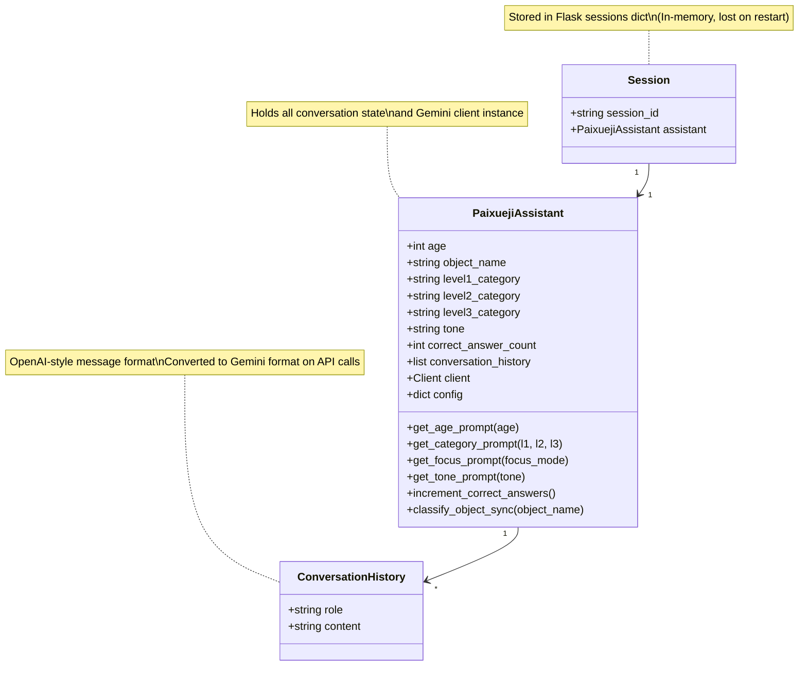

### State Transitions

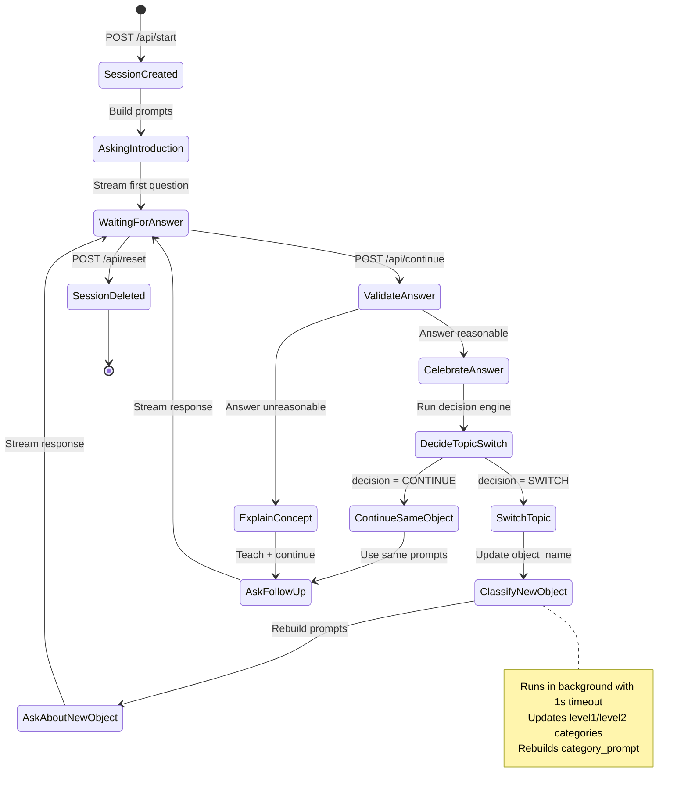

### Conversation History Format

**Storage Format (OpenAI-style):**
```python
conversation_history = [
    {"role": "system", "content": "Complete system prompt with all layers..."},
    {"role": "user", "content": "Start conversation about apple"},
    {"role": "assistant", "content": "Hi! Let's learn about apples! What color is the apple?"},
    {"role": "user", "content": "Red"},
    {"role": "assistant", "content": "Yes! Apples can be red! What shape is the apple?"}
]
```

**Converted to Gemini Format:**
```python
system_instruction = "Complete system prompt with all layers..."
contents = [
    {"role": "user", "parts": [{"text": "Start conversation about apple"}]},
    {"role": "model", "parts": [{"text": "Hi! Let's learn about apples! What color is the apple?"}]},
    {"role": "user", "parts": [{"text": "Red"}]},
    {"role": "model", "parts": [{"text": "Yes! Apples can be red! What shape is the apple?"}]}
]
```

---

## AI Decision Points

### 1. Answer Validation

**Function:** `is_answer_reasonable(child_answer: str) -> bool`

**Logic:**
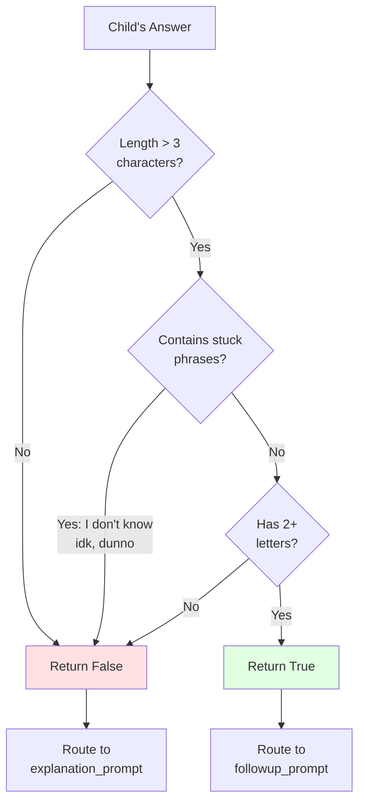

**Purpose:** Decide between celebrating answer vs. providing help

**Example Classifications:**
- ✅ "red" → Reasonable
- ✅ "it's round and smooth" → Reasonable
- ❌ "idk" → Unreasonable
- ❌ "???" → Unreasonable (too short)
- ❌ "I don't know" → Unreasonable

### 2. Topic Switch Detection

**Function:** `decide_topic_switch(assistant, child_answer, focus_mode, object_name, correct_count, age) -> dict`

**Structured Output Schema:**
```json
{
  "decision": "SWITCH" | "CONTINUE",
  "new_object": "ObjectName" | null,
  "reasoning": "Brief explanation"
}
```

**Decision Rules by Focus Mode:**

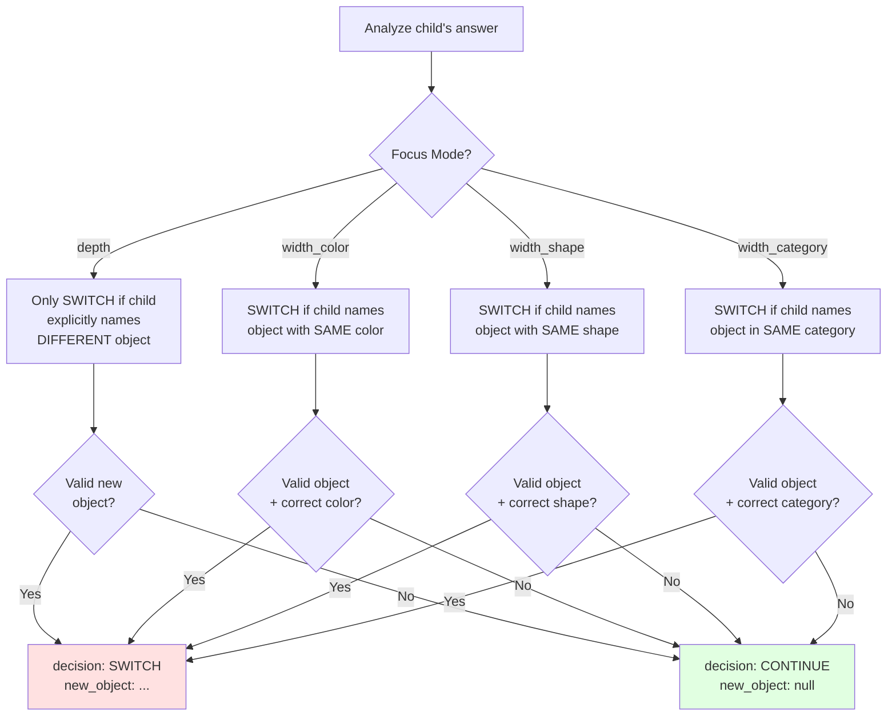

**API Call Parameters:**
```python
response = client.models.generate_content(
    model="gemini-2.0-flash-exp",
    contents=decision_prompt,
    config={
        "response_mime_type": "application/json",  # Force JSON
        "temperature": 0.1,  # Low temp for consistency
        "max_output_tokens": 100
    }
)
```

**Latency:** ~100-200ms per decision

### 3. Object Classification

**Function:** `classify_object_sync(object_name: str)`

**Purpose:** Determine object's category for context-aware questions

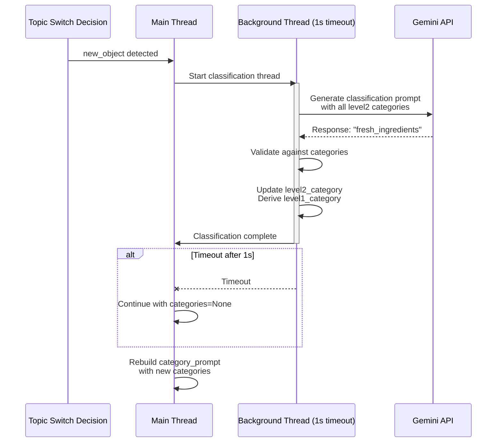

**Classification Prompt:**
```
Classify the object "{object_name}" into ONE of these categories:
- fresh_ingredients: Fresh fruits, vegetables, raw ingredients
- prepared_foods: Cooked dishes, packaged snacks
- ...

Respond with ONLY the category key, or "none" if it doesn't fit.
```

**Category Hierarchy:**
```
level1_category (broad)
  └─ level2_category (specific)
      └─ level3_category (very specific, optional)

Example:
foods
  └─ fresh_ingredients
      └─ tropical_fruits
```

**After Classification:**
- Updates `assistant.level1_category`, `level2_category`, `level3_category`
- Rebuilds `category_prompt` for next question
- Influences question topics (e.g., "taste" for foods, "sound" for animals)

---

## Technical Architecture

### API Endpoints

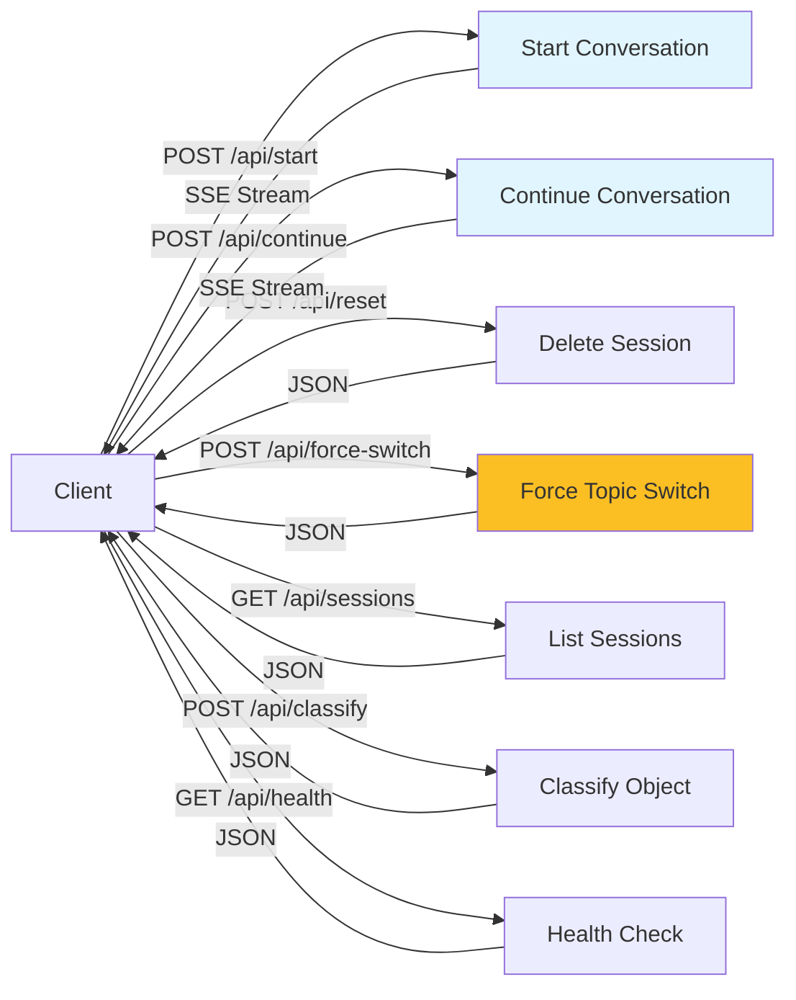

### Request/Response Contracts

#### POST /api/start

**Request:**
```json
{
  "age": 6,
  "object_name": "apple",
  "level1_category": "foods",
  "level2_category": "fresh_ingredients",
  "level3_category": null,
  "tone": "friendly",
  "focus_mode": "depth"
}
```

**Response (SSE Stream):**
```
event: chunk
data: {"response":"Hi","session_finished":false,"duration":0.0,"token_usage":null,"finish":false,"sequence_number":1,"timestamp":1234567890.123,"session_id":"...","request_id":"...","correct_answer_count":0,"conversation_complete":false,"focus_mode":"depth","is_correct":null,"new_object_name":null}

event: chunk
data: {"response":"! Let's","session_finished":false,...}

event: chunk
data: {"response":" learn about apples!","session_finished":false,...}

event: complete
data: {"success":true}
```

#### POST /api/continue

**Request:**
```json
{
  "session_id": "uuid-from-start",
  "child_input": "It's red and round",
  "focus_mode": "depth"
}
```

**Response:** Same SSE format as `/api/start`, with additional fields:
- `new_object_name`: Set if topic switch detected
- `detected_object_name`: Set if object detected but AI didn't switch
- `switch_decision_reasoning`: AI's explanation for the decision

#### POST /api/force-switch

**Purpose:** Manually override AI's decision and force a topic switch

**Request:**
```json
{
  "session_id": "uuid-from-start",
  "new_object": "cherry"
}
```

**Response:**
```json
{
  "success": true,
  "previous_object": "apple",
  "new_object": "cherry",
  "message": "Switched to cherry"
}
```

**Use Case:**
- AI detected "cherry" in child's answer but decided to CONTINUE
- UI shows manual override panel with detected object
- User clicks "Switch to cherry" button
- This endpoint updates session state and classifies new object

**Error Response:**
```json
{
  "success": false,
  "error": "Session not found"
}
```

### StreamChunk Schema

```python
class StreamChunk(BaseModel):
    response: str                          # Text to display
    session_finished: bool                 # Session ended?
    duration: float                        # Total time (only in final chunk)
    token_usage: TokenUsage | None         # Token counts (only in final chunk)
    finish: bool                           # Is this final chunk?
    sequence_number: int                   # Chunk order
    timestamp: float                       # Unix timestamp
    session_id: str                        # Session UUID
    request_id: str                        # Request UUID
    correct_answer_count: int              # Progress tracking
    conversation_complete: bool            # Always False (infinite mode)
    focus_mode: str | None                 # Current focus mode
    is_correct: bool | None                # Answer validation feedback
    new_object_name: str | None            # New object if topic switched
    detected_object_name: str | None       # Object AI detected but didn't switch to (for manual override)
    switch_decision_reasoning: str | None  # AI's explanation for switch/continue decision
```

**New Fields for AI-Driven Switching:**
- `detected_object_name`: Set when AI detects an object in child's answer but decides to CONTINUE
  - Triggers manual override UI panel
  - Example: Child says "red like cherry", AI continues but detects "cherry"
- `switch_decision_reasoning`: AI's explanation for every decision
  - Example: "Child directly answered the question about color. No topic change needed."
  - Logged and displayed in override panel

### Streaming Architecture

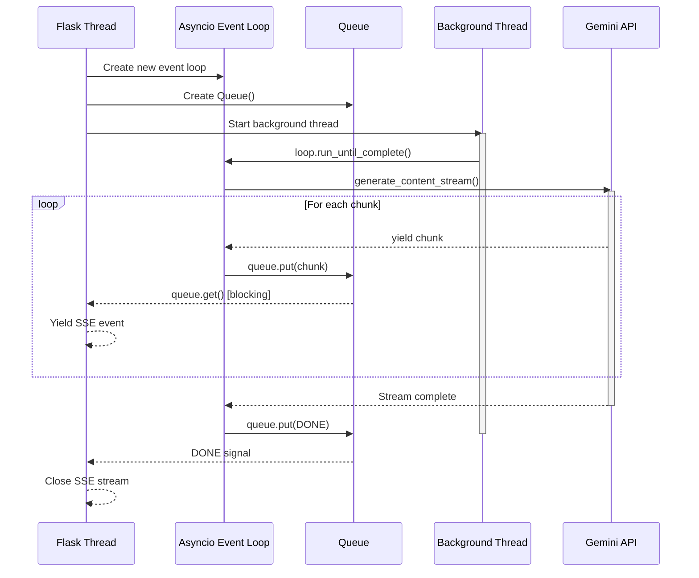

**Why This Architecture?**
- Flask requires sync generators for SSE
- Gemini API is async-only
- Queue bridges async → sync without buffering
- Each request gets isolated event loop (prevents race conditions)

### Prompt Composition System

**5-Layer Architecture:**

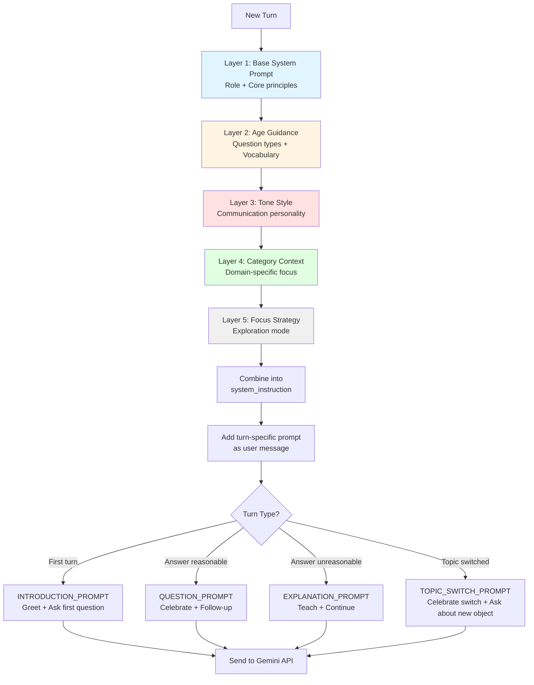

**Example Composition:**

```python
# Layer 1: Base
base = "You are a curious and encouraging learning companion..."

# Layer 2: Age (6 years old)
age_prompt = "Use WHAT and HOW questions. Keep sentences 5-8 words."

# Layer 3: Tone (friendly)
tone_prompt = "Use warm, encouraging language. Gentle and supportive."

# Layer 4: Category (fresh_ingredients)
category_prompt = "Ask about taste, texture, where grown, how eaten."

# Layer 5: Focus (width_color)
focus_prompt = "Ask child to think of OTHER objects with the same color."

# Final system instruction
system_instruction = f"{base}\n\nAGE GUIDANCE:\n{age_prompt}\n\nTONE:\n{tone_prompt}\n\nCATEGORY:\n{category_prompt}"

# Turn-specific prompt (added as user message)
turn_prompt = f"Child answered: 'red'. FOCUS STRATEGY: {focus_prompt}. Ask follow-up."
```

### Data Flow Summary

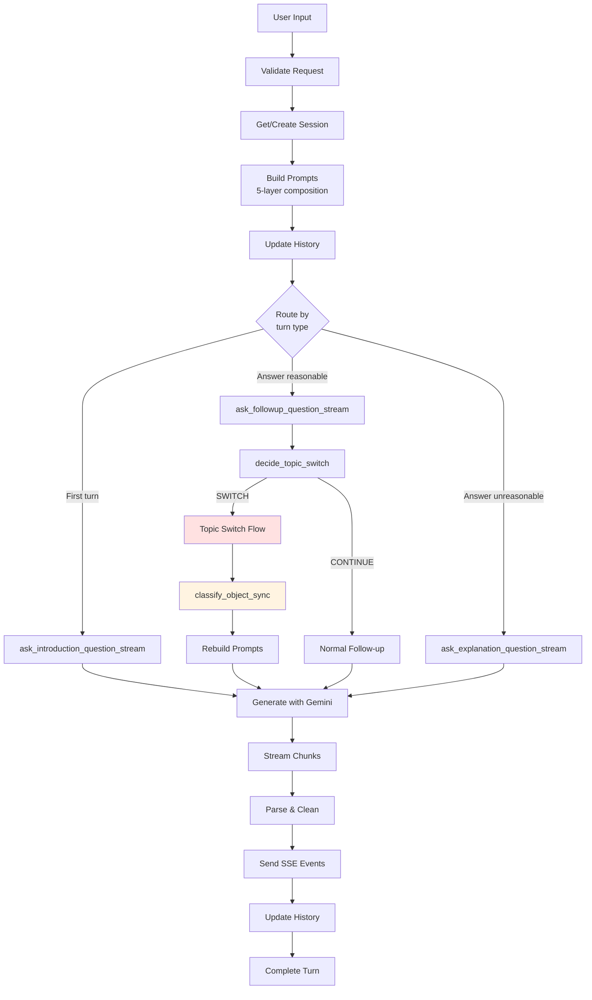

---

## Extension Guide

### Adding a New Focus Mode

**Example: Add "width_function" mode (explore objects by what they do)**

1. **Define focus prompt** in `paixueji_prompts.py`:
```python
FOCUS_PROMPTS = {
    # ... existing modes
    "width_function": """
    Functional exploration starting from {object_name}:
    - Ask child to think of OTHER objects that do a SIMILAR thing
    - Example: hammer → "What else can you use to build things?"
    - If child names a valid object with related function → SWITCH to it
    - Celebrate functional connections!
    """
}
```

2. **Update decision rules** in `decide_topic_switch()`:
```python
# In paixueji_stream.py, line ~276
decision_prompt = f"""
...
DECISION RULES:
...
5. **WIDTH_FUNCTION mode**: SWITCH if child names ANY real object with SIMILAR FUNCTION
...
"""
```

3. **Add to frontend** `static/index.html`:
```html
<select id="nextQuestionFocus">
    <!-- ... existing options -->
    <option value="width_function">Width: Function (explore by what objects do)</option>
</select>
```

4. **Test the flow:**
```
Object: Hammer (width_function mode)
Q: "What does a hammer do?"
A: "It builds things"
Q: "Great! What else can you use to build things?"
A: "Screwdriver"
→ SWITCH to Screwdriver
```

### Adding a New Age Group

**Example: Add age 9-10 support**

1. **Add age prompts** in `age_prompts.json`:
```json
{
  "age_groups": {
    "9-10": {
      "prompt": "Use advanced WHY and complex HOW questions. Encourage critical thinking and comparison. Can use 12-15 word sentences with more complex vocabulary.",
      "question_types": ["WHAT", "HOW", "WHY", "COMPARE"],
      "example_questions": [
        "Why do you think this object was designed this way?",
        "How does this compare to similar objects you know?"
      ]
    }
  }
}
```

2. **Update age validation** in `paixueji_assistant.py`:
```python
def get_age_prompt(self, age):
    # ... existing code
    elif 9 <= age <= 10:
        return age_groups.get('9-10', {}).get('prompt', '')
```

3. **Update frontend range** in `static/index.html`:
```html
<input type="number" id="age" min="3" max="10" value="6">
```

### Adding Custom Categories

**Example: Add "vehicles" category with subcategories**

1. **Add to** `object_prompts.json`:
```json
{
  "level1_categories": {
    "vehicles": {
      "prompt": "Ask about how it moves, what it's used for, parts it has."
    }
  },
  "level2_categories": {
    "land_vehicles": {
      "parent": "vehicles",
      "prompt": "Ask about wheels, speed, where it drives, who uses it."
    },
    "air_vehicles": {
      "parent": "vehicles",
      "prompt": "Ask about wings, how it flies, where it goes, who pilots it."
    }
  }
}
```

2. **Update classification prompt** in `paixueji_prompts.py`:
```python
CLASSIFICATION_PROMPT = """
...
Available categories:
{categories_list}

Include the new categories in your classification logic.
"""
```

3. **Test classification:**
```python
# POST /api/classify
{
  "object_name": "airplane"
}

# Response:
{
  "level1_category": "vehicles",
  "level2_category": "air_vehicles"
}
```

### Implementing Session Persistence

**Current State:** Sessions stored in-memory (lost on restart)

**Migration to Redis:**

1. **Install Redis client:**
```bash
pip install redis
```

2. **Update** `app.py`:
```python
import redis
import pickle

# Replace in-memory dict
redis_client = redis.Redis(host='localhost', port=6379, decode_responses=False)

# Store session
def save_session(session_id, assistant):
    redis_client.setex(
        f"session:{session_id}",
        3600,  # 1 hour TTL
        pickle.dumps(assistant)
    )

# Retrieve session
def get_session(session_id):
    data = redis_client.get(f"session:{session_id}")
    if data:
        return pickle.loads(data)
    return None
```

3. **Update endpoints:**
```python
@app.route('/api/start', methods=['POST'])
def start_conversation():
    # ... existing code
    assistant = PaixuejiAssistant()
    save_session(session_id, assistant)  # Changed

@app.route('/api/continue', methods=['POST'])
def continue_conversation():
    # ... existing code
    assistant = get_session(session_id)  # Changed
    if not assistant:
        return jsonify({"error": "Session expired"}), 404
```

### Adding Analytics & Logging

**Track conversation metrics:**

1. **Define metrics schema:**
```python
class ConversationMetrics(BaseModel):
    session_id: str
    total_turns: int
    correct_answers: int
    topic_switches: int
    focus_modes_used: list[str]
    objects_discussed: list[str]
    average_response_time: float
    completion_time: float
```

2. **Track in assistant:**
```python
class PaixuejiAssistant:
    def __init__(self):
        # ... existing code
        self.metrics = {
            "turns": 0,
            "switches": 0,
            "objects": [],
            "response_times": []
        }

    def track_turn(self, response_time):
        self.metrics["turns"] += 1
        self.metrics["response_times"].append(response_time)

    def track_switch(self, new_object):
        self.metrics["switches"] += 1
        self.metrics["objects"].append(new_object)
```

3. **Export on session end:**
```python
@app.route('/api/metrics/<session_id>', methods=['GET'])
def get_metrics(session_id):
    assistant = sessions.get(session_id)
    if not assistant:
        return jsonify({"error": "Session not found"}), 404

    return jsonify({
        "session_id": session_id,
        "metrics": assistant.metrics
    })
```

---

## Appendix: Key Files Reference

| File | Purpose | Key Functions |
|------|---------|---------------|
| `app.py` | Flask server, routes, SSE streaming | `start_conversation()`, `continue_conversation()`, `force_switch()`, `async_gen_to_sync()` |
| `paixueji_assistant.py` | Session state, client management | `get_age_prompt()`, `get_focus_prompt()`, `classify_object_sync()` |
| `paixueji_stream.py` | Streaming logic, AI calls | `ask_introduction_question_stream()`, `ask_followup_question_stream()`, `decide_topic_switch()` |
| `paixueji_prompts.py` | Prompt templates | `SYSTEM_PROMPT`, `QUESTION_PROMPT`, `EXPLANATION_PROMPT`, `FOCUS_PROMPTS` |
| `schema.py` | Pydantic models | `StreamChunk`, `TokenUsage` |
| `static/app.js` | Frontend SSE handling | `startConversation()`, `continueConversation()`, `forceSwitch()`, `dismissSwitchPanel()` |

---

## Version 2.0 Updates: AI-Driven Contextual Switching

### Key Architectural Changes (December 2025)

**What Changed:**
1. ✅ **Decoupled Concerns**: Focus modes now control question style ONLY, not switching behavior
2. ✅ **AI-Driven Decisions**: Topic switching uses conversation context instead of hardcoded rules
3. ✅ **Manual Override**: New UI panel allows users to override AI decisions
4. ✅ **Transparency**: AI explains every decision with reasoning

**Migration from v1.0:**
- **Removed**: Hardcoded switching rules in `FOCUS_PROMPTS` (e.g., "Only SWITCH if...")
- **Added**: Contextual decision prompt with last question + answer analysis
- **Added**: `/api/force-switch` endpoint for manual topic changes
- **Added**: `detected_object_name` and `switch_decision_reasoning` fields to `StreamChunk`

**Performance Impact:**
- ⚡ **Zero additional latency** - Same 1 API call, smarter prompt
- ✅ Decision time: ~100-200ms (unchanged)
- ✅ Same streaming performance

**Benefits:**
- 🎯 Natural conversation flow (mimics human teachers)
- 🧠 Context-aware decisions (what was asked vs answered)
- 🔧 User control (manual override when needed)
- 📊 Full transparency (AI explains every decision)
- 🚀 Handles edge cases better (no rigid rules)

---

**Document Version:** 2.0
**Last Updated:** 2025-12-31
**Major Update:** AI-Driven Contextual Topic Switching
**Maintained By:** Development Team

For questions or updates to this architecture, please update this document and commit changes to the repository.
