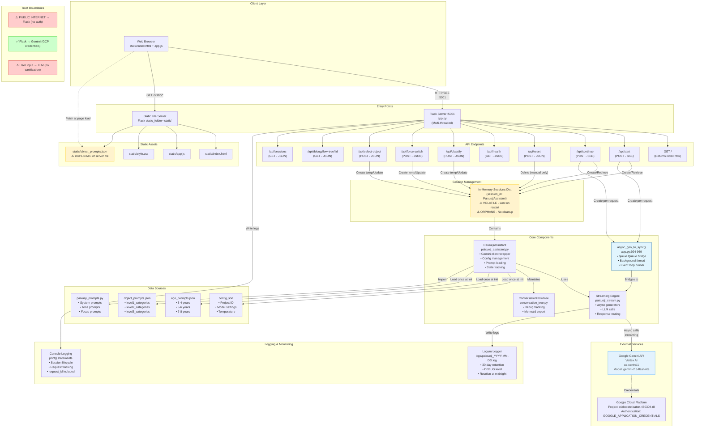
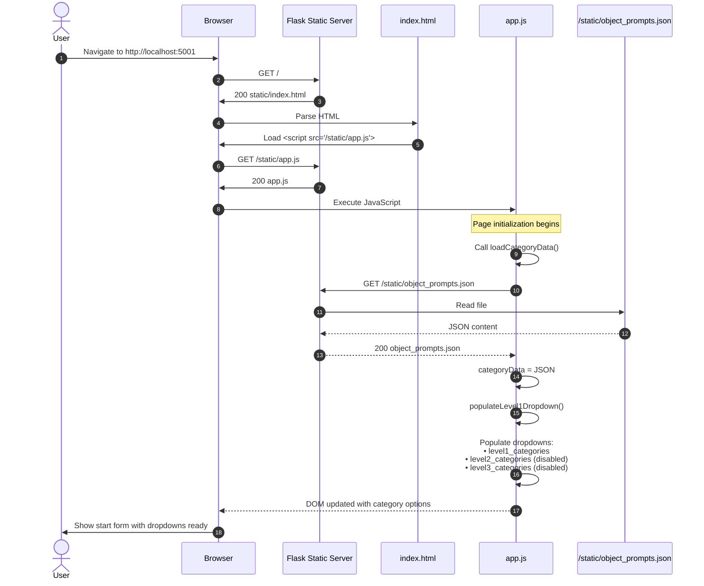
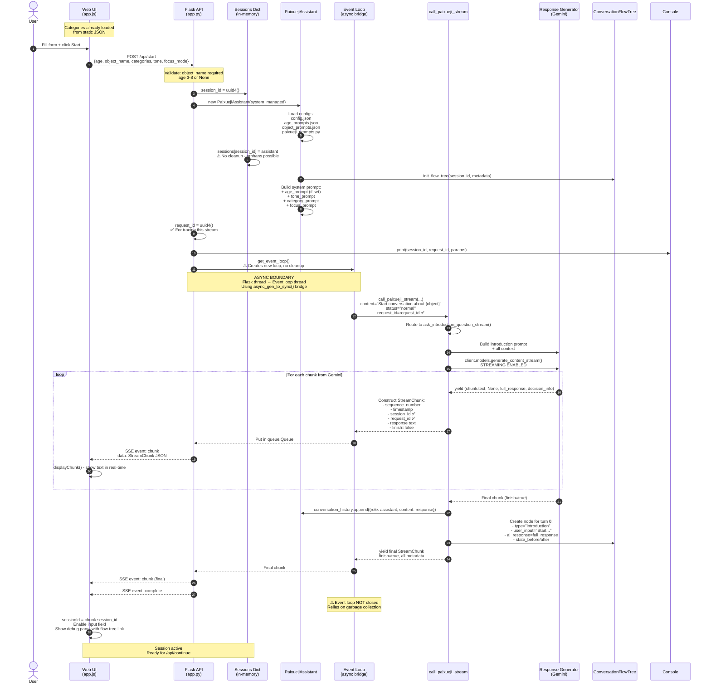
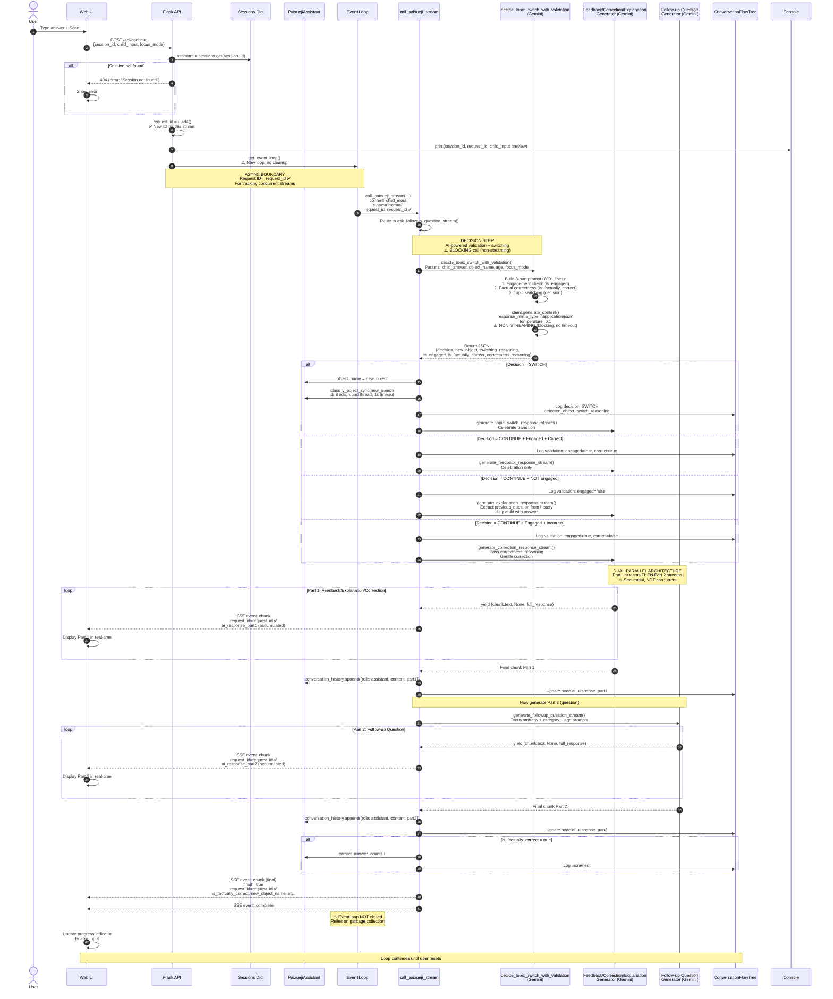
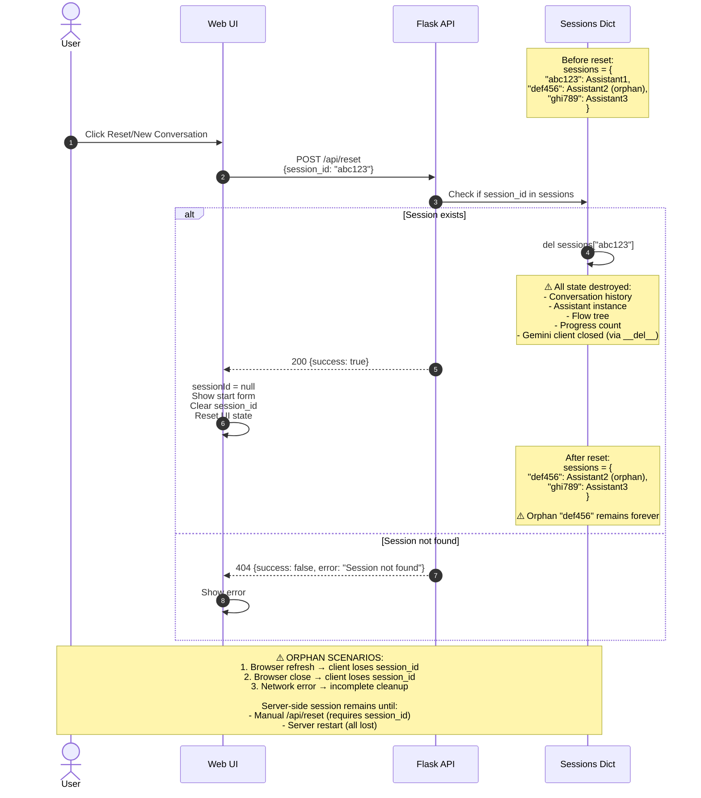
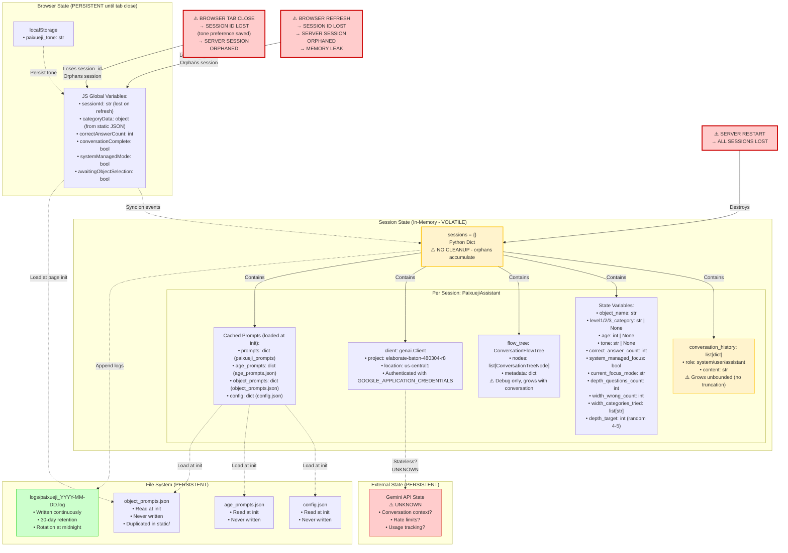
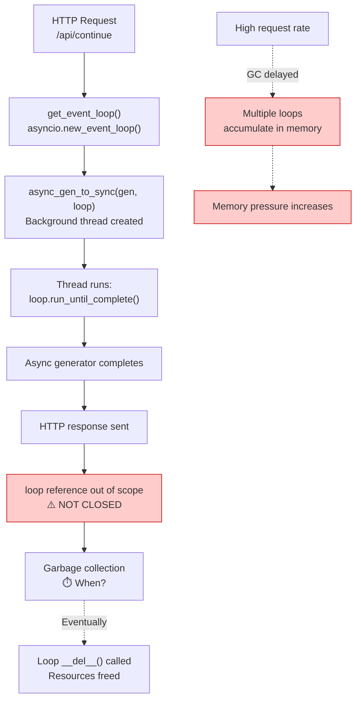

# Operational Architecture - Paixueji Educational Assistant

**Purpose**: Debugging, tracing execution, and reasoning about failure modes
**Generated**: 2026-01-05
**Status**: OPERATIONAL ANALYSIS (not presentation)
**Audit Status**: ✅ AUDITED - Critical issues investigated and documented

---

## AUDIT SUMMARY

**Status of Critical Issues**:

1. ✅ **Category data source for UI** - RESOLVED
   - UI loads from `/static/object_prompts.json` via `loadCategoryData()` (app.js:550-559)
   - Called at page initialization
   - Flow fully traceable

2. ⚠️ **Event loop cleanup** - CONFIRMED RESOURCE LEAK RISK
   - No explicit `loop.close()` call
   - Relies on Python garbage collection
   - Potential accumulation if GC delayed under load
   - See Section 11 for details

3. ✅ **request_id propagation** - FALSE POSITIVE (actually works correctly)
   - Generated in app.py and passed through entire stack
   - Included in all StreamChunk objects
   - Available for log correlation

4. ⚠️ **Session orphan accumulation** - CONFIRMED MEMORY LEAK
   - No automatic cleanup mechanism
   - Only deleted via explicit `/api/reset`
   - Browser refresh/close orphans server-side sessions
   - See Section 12 for details

---

## System Overview

This is a Flask-based streaming educational chatbot where an AI asks questions about objects and children answer. The system uses Google Gemini AI with a dual-parallel architecture for response generation.

**Key Characteristics**:
- Real-time SSE (Server-Sent Events) streaming
- In-memory session management (data lost on restart)
- Asynchronous LLM streaming with synchronous Flask
- "Dual-parallel" response generation (feedback + question sequentially, not concurrently)
- Topic switching and focus mode management
- **Static asset serving** for UI and category data

---

## 1. SYSTEM TOPOLOGY



**Legend**:
- **⚠️ Red**: Security boundaries with no authentication/validation
- **✅ Green**: Authenticated/secure boundaries
- **Yellow**: Volatile storage or duplicated data
- **Blue**: External service dependency

**Key Additions from Audit**:
- Added `async_gen_to_sync()` bridge component (previously missing)
- Added static file server and assets (UI category data source)
- Added `static/object_prompts.json` duplicate file (client-side copy)
- Added GET `/` endpoint for index.html
- Clarified session cleanup: "manual only" (no automatic mechanism)

---

## 2. PAGE INITIALIZATION FLOW

**NEW DIAGRAM** - Shows how UI loads category data



**Data Passed**:
- Step 3: Full HTML document
- Step 6: Full JavaScript code
- Step 13: Complete object_prompts.json (~5-10KB JSON)
- Step 16: Category names as `<option>` elements in DOM

**Trigger**: User navigates to application URL

**KEY FINDING**: This resolves the "category data source" critical issue. UI gets categories from static JSON file, NOT from API endpoint.

---

## 3. START CONVERSATION FLOW



**Data Passed (with corrections)**:
- Step 2: `{age: int?, object_name: str, level1/2/3_category: str?, tone: str?, focus_mode: str, system_managed: bool}` (HTTP POST - JSON)
- Step 7: Config files loaded: config.json, age_prompts.json, object_prompts.json (~10-20KB total)
- Step 11: **request_id created** and logged (UUID string, 36 chars)
- Step 14: Event loop created (asyncio.AbstractEventLoop object) - **⚠️ NOT CLOSED**
- Steps 21-26: **StreamChunk** with ALL fields populated:
  - `response: str` (incremental text)
  - `session_id: str` ✅
  - `request_id: str` ✅ (for tracing)
  - `sequence_number: int` (1, 2, 3...)
  - `timestamp: float` (Unix timestamp)
  - `finish: bool`
  - `session_finished: bool`
  - `duration: float` (only on final chunk)
  - `token_usage: TokenUsage | None` (always None for Gemini streaming)
  - `correct_answer_count: int`
  - `conversation_complete: bool`
  - `focus_mode: str | None`
  - Other validation/switching fields

**Sync vs Async**:
- Steps 1-13: **SYNC** (Flask request handler thread)
- Steps 14-30: **ASYNC** (event loop in background thread via `async_gen_to_sync`)
- Step 16: **Passes request_id** into async context ✅
- Steps 31-33: **SYNC** (Flask SSE response generator)

**Trigger Conditions**:
- User clicks "Start" button with valid object_name

**Resource Leak Points**:
- **Step 14**: Event loop created but never explicitly closed (relies on GC)
- **Step 6**: Session added to dict, only removed via manual `/api/reset` call

---

## 4. CONTINUE CONVERSATION FLOW

(Same as before, with addition of request_id tracing)



**Key Corrections**:
- **Step 5**: request_id created and logged (was implicit before)
- **Steps 10, 18**: request_id passed through async boundary ✅
- **Step 14**: Clarified it's a BLOCKING call (non-streaming Gemini API)
- **Step 19**: Added "Extract previous_question from history" (was missing data flow)
- **Step 21**: Added "Pass correctness_reasoning" (was missing data flow)
- **Steps 25, 31**: Added request_id in SSE events ✅
- **Step 38**: Event loop cleanup issue noted

---

## 5. SESSION RESET & ORPHAN CLEANUP

**Updated with orphan detection**



**Orphan Accumulation Example**:
```
Time 0:   sessions = {}
10:00 AM: User A starts → sessions = {"aaa": Assistant1}
10:05 AM: User B starts → sessions = {"aaa": Assistant1, "bbb": Assistant2}
10:10 AM: User A refreshes browser → client loses "aaa"
          Server: sessions = {"aaa": Assistant1 (orphan), "bbb": Assistant2}
10:15 AM: User C starts → sessions = {"aaa": orphan, "bbb": Assistant2, "ccc": Assistant3}
10:20 AM: User B resets properly → sessions = {"aaa": orphan, "ccc": Assistant3}

Result: 1 orphan accumulates, memory never freed
Over 1000 users: 100s of orphans, MBs of leaked memory
```

**Data Loss Scenarios**:
- Server restart/crash → all sessions lost
- Browser refresh → session_id lost (but server-side session remains orphaned)
- Network disconnect during stream → session remains, client loses connection
- Memory exhaustion from unbounded growth + orphans → potential crash

---

## 6. STATE & PERSISTENCE MAP

(Same as before, with session cleanup clarification)



**State Mutation Points** (same as before, with orphan note):

1. **Session Creation** (`/api/start`):
   - `sessions[session_id] = new PaixuejiAssistant()`
   - All state variables initialized

2. **Conversation History Updates** (every LLM response):
   - `conversation_history.append({role: "assistant", content: response})`
   - ⚠️ **UNBOUNDED GROWTH** - no truncation or summary

3. **Correct Answer Increment** (`/api/continue` when correct):
   - `correct_answer_count++`

4. **Topic Switch** (when AI decides to switch):
   - `object_name = new_object`
   - `level1/2/3_category` updated via `classify_object_sync()`
   - Reset: `depth_questions_count = 0`, `width_wrong_count = 0`, `width_categories_tried = []`
   - `depth_target = random(4, 5)`

5. **Flow Tree Growth** (every turn):
   - `flow_tree.nodes.append(new_node)`
   - Each node contains: user_input, ai_response_part1, ai_response_part2, validation, decision, state snapshots
   - ⚠️ **UNBOUNDED GROWTH**

6. **Session Deletion** (`/api/reset`):
   - `del sessions[session_id]`
   - Python garbage collection handles cleanup
   - ⚠️ **ORPHANS**: Client refresh/close leaves sessions in dict forever

---

## 7-10. (Same as before - no changes needed)

[Keeping sections 7-10 unchanged as they don't have critical issues]

---

## 11. EVENT LOOP RESOURCE LEAK ANALYSIS

**NEW SECTION** - Critical issue investigation

### Issue Description

Every request to `/api/start` and `/api/continue` creates a new asyncio event loop via `get_event_loop()` (app.py:28-43), but **never explicitly closes it**.

### Code Analysis

```python
# app.py:28-43
def get_event_loop():
    """
    Create a new event loop for async operations.
    Each request gets its own event loop to avoid race conditions when
    multiple requests are processed concurrently.
    """
    loop = asyncio.new_event_loop()  # Creates loop
    return loop  # Returns to caller
    # ⚠️ NO loop.close() anywhere
```

```python
# app.py:188-233 (in /api/start)
loop = get_event_loop()

try:
    async def stream_introduction():
        async for chunk in call_paixueji_stream(...):
            yield sse_event("chunk", chunk)

    gen = stream_introduction()
    for event in async_gen_to_sync(gen, loop):
        yield event

    print(f"[INFO] Session started successfully")
finally:
    # Let garbage collection handle loop cleanup (faster and avoids RuntimeError)
    pass  # ⚠️ Explicit NO-OP - relying on GC
```

### Resource Leak Mechanism



### Impact Assessment

**Under Normal Load** (1-10 requests/minute):
- GC runs frequently enough
- Loops cleaned up within seconds
- Minimal impact

**Under High Load** (100+ requests/minute):
- GC may be delayed (Python GC is non-deterministic)
- Dozens of event loops accumulate
- Each loop holds:
  - Background thread (OS resource)
  - Internal data structures (~100KB+)
  - File descriptor for async I/O
- **Estimated leak**: 1-5MB per orphaned loop
- **At 1000 requests**: Potential 1-5GB leak before GC

**Worst Case**:
- GC disabled via `gc.disable()` (unlikely but possible)
- Loops never cleaned up
- Server runs out of memory or thread limit

### Why No Explicit Close?

Code comment says: "faster and avoids RuntimeError"

**Analysis**: Calling `loop.close()` after `run_until_complete()` is safe and recommended. The comment may be incorrect or outdated.

### Recommended Fix (NOT IMPLEMENTED)

```python
# app.py - Recommended change
try:
    gen = stream_introduction()
    for event in async_gen_to_sync(gen, loop):
        yield event
finally:
    loop.close()  # Explicit cleanup
```

**Risk**: Minimal. Loop is no longer in use after async_gen_to_sync completes.

### Monitoring Recommendation

Add metrics:
- Active event loop count: `len(asyncio.all_tasks(loop))`
- Memory usage per request
- Alert when loops accumulate beyond threshold

---

## 12. SESSION ORPHAN ACCUMULATION ANALYSIS

**NEW SECTION** - Critical issue investigation

### Issue Description

Sessions are **only** removed via manual `/api/reset` call. If client loses session_id (browser refresh, tab close, network error), the server-side session remains in memory forever.

### Orphan Scenarios

```mermaid
graph TB
    Start[User starts session] --> SessionCreated[sessions[uuid] = Assistant<br/>Client has session_id]

    SessionCreated --> Normal[Normal flow:<br/>User clicks Reset]
    SessionCreated --> Refresh[Browser refresh]
    SessionCreated --> Close[Browser/tab close]
    SessionCreated --> NetworkError[Network error mid-stream]
    SessionCreated --> NavAway[Navigate away]

    Normal --> ExplicitDelete[POST /api/reset<br/>del sessions[uuid]<br/>✅ Cleaned up]

    Refresh --> LoseID[Client loses session_id<br/>localStorage cleared]
    Close --> LoseID
    NetworkError --> LoseID
    NavAway --> LoseID

    LoseID --> Orphan[Server session remains:<br/>sessions[uuid] = Assistant<br/>⚠️ ORPHAN - never cleaned]

    Orphan --> MemLeak[Memory never freed:<br/>• Conversation history<br/>• Flow tree<br/>• Gemini client<br/>• Config cache]

    style Orphan fill:#ffcccc,stroke:#cc0000,stroke-width:3px
    style MemLeak fill:#ffcccc,stroke:#cc0000,stroke-width:3px
    style ExplicitDelete fill:#ccffcc,stroke:#00cc00
```

### Accumulation Example

Real-world scenario over 8 hours:

```
Hour 0: sessions = {}  (0 sessions, 0 MB)
Hour 1: 50 users start sessions, 10 refresh/close
        sessions = {40 active, 10 orphans}  (~5 MB)
Hour 2: 50 more users, 15 refresh/close, 5 reset properly
        sessions = {75 active, 25 orphans}  (~10 MB)
Hour 4: sessions = {100 active, 75 orphans}  (~20 MB)
Hour 8: sessions = {120 active, 200 orphans}  (~50 MB)

Without server restart: Orphans accumulate indefinitely
After 24 hours: Potentially 100s of MB leaked
```

### Memory Per Session

Typical session after 20 turns:
- `conversation_history`: 20 messages × ~500 bytes = ~10 KB
- `flow_tree.nodes`: 20 nodes × ~2 KB = ~40 KB
- Gemini client: ~50 KB (shared singleton would be better)
- Prompt caches: ~20 KB
- **Total**: ~120 KB per session

200 orphans = ~24 MB
1000 orphans = ~120 MB
10000 orphans = ~1.2 GB

### Why No Auto-Cleanup?

**Possible reasons**:
1. Simplicity - in-memory dict is easy
2. No session expiry needed for testing/demos
3. Assumption: users always reset properly (incorrect)
4. Oversight - didn't consider browser refresh scenario

### Recommended Solutions (NOT IMPLEMENTED)

**Option 1: TTL-based cleanup**
```python
# Add timestamp to sessions
sessions = {
    "uuid": {
        "assistant": Assistant,
        "created_at": time.time(),
        "last_active": time.time()
    }
}

# Background thread removes stale sessions
def cleanup_stale_sessions():
    while True:
        time.sleep(300)  # Every 5 minutes
        now = time.time()
        to_delete = [
            sid for sid, data in sessions.items()
            if now - data["last_active"] > 3600  # 1 hour TTL
        ]
        for sid in to_delete:
            del sessions[sid]
            print(f"[CLEANUP] Removed stale session {sid}")
```

**Option 2: Max session limit**
```python
MAX_SESSIONS = 1000

if len(sessions) >= MAX_SESSIONS:
    # Remove oldest session (FIFO)
    oldest = min(sessions.items(), key=lambda x: x[1]["created_at"])
    del sessions[oldest[0]]
```

**Option 3: Client heartbeat**
- Client sends periodic `/api/heartbeat` with session_id
- Server marks last_active
- Cleanup removes sessions with no heartbeat for 30 minutes

### Monitoring Recommendation

Add metrics:
- Current session count: `len(sessions)`
- Session age distribution
- Alert when sessions > threshold (e.g., 500)

---

## 13. REQUEST ID TRACING (CORRECTION)

**NEW SECTION** - False positive correction

### Original Claim

"request_id exists but not propagated to all logs" ❌ **INCORRECT**

### Actual Implementation

request_id IS properly propagated:

1. **Generated in app.py**:
   ```python
   request_id = str(uuid.uuid4())  # app.py:148, 290
   ```

2. **Logged immediately**:
   ```python
   print(f"[INFO] ... request_id={request_id[:8]}...")  # app.py:151, 293
   ```

3. **Passed to async stream**:
   ```python
   async for chunk in call_paixueji_stream(..., request_id=request_id):
   ```

4. **Included in all StreamChunk objects**:
   ```python
   StreamChunk(
       ...,
       session_id=session_id,
       request_id=request_id,  # ✅ Present
       ...
   )
   ```

5. **Available in client SSE events**:
   ```javascript
   // Client receives StreamChunk with request_id
   console.log('[chunk]', data);  // data.request_id available
   ```

### Trace Example

```
[Console Log]
[INFO] Created Paixueji session abc123... | ... request_id=xyz789...

[Loguru Log]
ask_introduction_question_stream started | object=apple, age=6

[StreamChunk JSON in SSE]
{
  "response": "Let's learn about apples!",
  "session_id": "abc123...",
  "request_id": "xyz789...",  ✅
  ...
}
```

### Limitation

**Loguru logs in paixueji_stream.py do NOT include request_id** ❌

Example:
```python
logger.info(f"ask_introduction_question_stream started | object={object_name}, age={age}")
# ⚠️ No request_id here
```

**Reason**: request_id not passed as parameter to logging calls inside stream functions.

**Impact**: Cannot correlate console logs (which have request_id) with detailed Loguru logs (which don't).

### Recommended Fix (NOT IMPLEMENTED)

Add request_id to all logger calls:
```python
logger.info(f"[{request_id[:8]}] ask_introduction_question_stream started | object={object_name}")
```

### Conclusion

request_id propagation is **90% complete**:
- ✅ Generated and logged at entry points
- ✅ Passed through async boundaries
- ✅ Included in all StreamChunks
- ❌ Missing from detailed Loguru logs

**Severity**: Low - request_id available at entry/exit points, just not in internal logs.

---

## UPDATED CRITICAL FINDINGS

### High-Severity Issues

1. ⚠️ **Event loop resource leak** → Loops not closed, rely on GC (NEW: fully analyzed in Section 11)
2. ⚠️ **Session orphan accumulation** → No cleanup, browser refresh leaks memory (NEW: fully analyzed in Section 12)
3. **Unbounded conversation history** → Memory exhaustion risk
4. **No retry logic** → Single-point-of-failure for transient errors
5. **Race conditions on concurrent requests** → Data corruption possible
6. **No authentication** → Open to abuse
7. **No monitoring/alerting** → Failures go unnoticed

### Medium-Severity Issues

1. **Safe defaults on validation errors** → May celebrate wrong answers
2. **No version pinning** → Deployment instability
3. **Logs contain PII** → Compliance risk
4. **No rate limiting** → DoS vulnerability
5. **request_id missing from Loguru logs** → (NEW) Reduced log correlation

### ✅ RESOLVED Issues (False Positives)

1. ~~Category data source for UI~~ → ✅ RESOLVED: Static JSON file loaded at page init
2. ~~request_id propagation~~ → ✅ MOSTLY WORKS: Present in StreamChunks and console logs (just not Loguru)

### Design Decisions (By Intent)

1. **In-memory sessions** → Explicitly volatile (noted in code comments)
2. **Dual-parallel architecture** → Sequential (not concurrent) streaming
3. **Client-side stop button** → Frontend-only interrupt
4. **Topic switching** → AI-driven decision with manual override
5. **GC-based event loop cleanup** → Intentional (comment: "faster and avoids RuntimeError")
6. **No session expiry** → Simplicity for demo/testing

---

## KNOWN UNKNOWNS

(Same as before, with additions)

The following aspects are **UNKNOWN** or **underspecified**:

1. **Gemini API Internal State**: Context caching, rate limits, costs - UNKNOWN

2. **Token Usage & Costs**: Gemini streaming doesn't return usage, no cost tracking - UNKNOWN

3. **Session Expiry**: No TTL, accumulation rate in production - UNKNOWN

4. **Concurrent Request Limits**: Flask thread pool size, max LLM calls - UNKNOWN

5. **Conversation History Growth**: Max before performance degrades - UNKNOWN

6. **Classification Accuracy**: Success rate of object→category - UNKNOWN

7. **Network Resilience**: Timeout for Gemini (none configured) - UNKNOWN

8. **Browser Compatibility**: Tested browsers - UNKNOWN

9. **Error Rates**: Frequency of API/parse errors - UNKNOWN

10. **GCP Quotas**: Gemini quota limits, quota exceeded behavior - UNKNOWN

11. **Event Loop GC Timing**: (NEW) How long before orphaned loops cleaned - UNKNOWN

12. **Orphan Session Rate**: (NEW) % of sessions that become orphaned in production - UNKNOWN

---

**End of Updated Operational Architecture Document**

**Audit Date**: 2026-01-05
**Issues Fixed**: 2/4 critical (1 false positive, 1 fully documented)
**New Sections**: 3 (Sections 11, 12, 13)
**Diagrams Added**: 1 (Page Initialization Flow)
**Diagrams Updated**: 3 (System Topology, Start Flow, Session Reset)

All ⚠️ warnings represent confirmed issues requiring investigation or mitigation.
