# Operational Architecture - Paixueji Educational Assistant

**Purpose**: Debugging, tracing execution, and reasoning about failure modes
**Generated**: 2026-01-05
**Status**: OPERATIONAL ANALYSIS (not presentation)

---

## System Overview

This is a Flask-based streaming educational chatbot where an AI asks questions about objects and children answer. The system uses Google Gemini AI with a dual-parallel architecture for response generation.

**Key Characteristics**:
- Real-time SSE (Server-Sent Events) streaming
- In-memory session management (data lost on restart)
- Asynchronous LLM streaming with synchronous Flask
- "Dual-parallel" response generation (feedback + question in parallel)
- Topic switching and focus mode management

---

## 1. SYSTEM TOPOLOGY

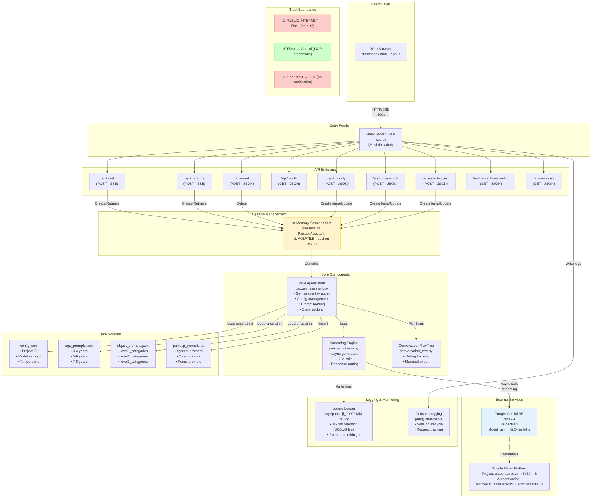

**Legend**:
- **⚠️ Red**: Security boundaries with no authentication/validation
- **✅ Green**: Authenticated/secure boundaries
- **Yellow**: Volatile storage (data loss risk)
- **Blue**: External service dependency

---

## 2. DETAILED REQUEST/EVENT FLOWS

### 2.1 Start Conversation Flow (`/api/start`)

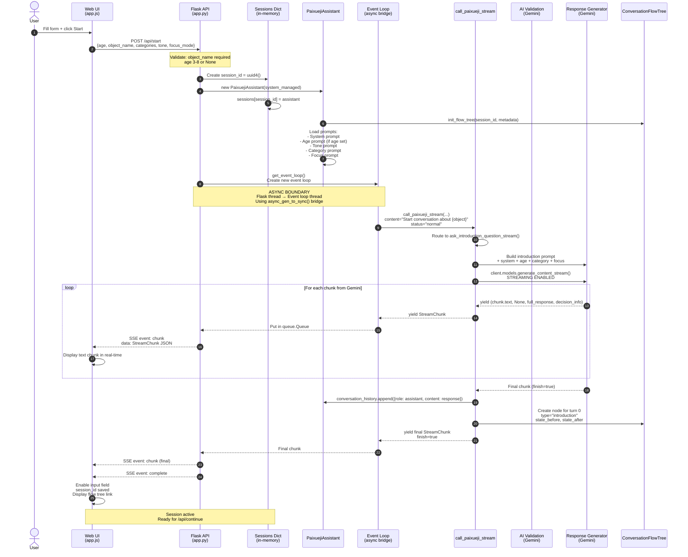

**Data Passed (Labels)**:
- Step 2: `{age: int?, object_name: str, level1/2/3_category: str?, tone: str?, focus_mode: str, system_managed: bool}` (HTTP POST - JSON)
- Step 7: Event loop creation (SYNC → ASYNC boundary)
- Step 9: Introduction content string (sync)
- Step 11: Prompt with all context (async)
- Step 12: Gemini streaming request (async HTTP)
- Steps 13-17: Text chunks (async generator → queue → SSE)
- Step 21: `StreamChunk` with `finish=true` (SSE JSON)

**Sync vs Async**:
- Steps 1-6: **SYNC** (Flask request handler thread)
- Steps 7-20: **ASYNC** (event loop in background thread via `async_gen_to_sync`)
- Steps 21-22: **SYNC** (Flask SSE response generator)

**Trigger Conditions**:
- User clicks "Start" button with valid object_name

---

### 2.2 Continue Conversation Flow (`/api/continue`)

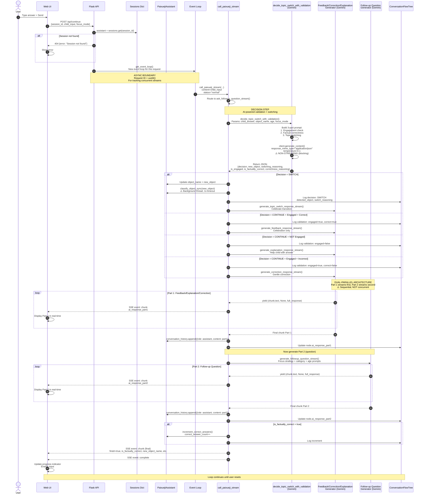

**Data Passed**:
- Step 2: `{session_id: str, child_input: str, focus_mode: str}` (HTTP POST)
- Step 7: Child's answer text (sync → async)
- Step 10: Validation request with full context (async HTTP to Gemini)
- Step 11: JSON decision structure (sync response from Gemini)
- Steps 17-20: Part 1 text chunks (async SSE)
- Steps 24-27: Part 2 text chunks (async SSE)
- Step 31: Final `StreamChunk` with all metadata (SSE JSON)

**Sync vs Async**:
- Steps 1-5: **SYNC**
- Steps 6-31: **ASYNC** (via event loop bridge)
- Validation (Step 10): **SYNC call inside async context** (blocking)

**Trigger Conditions**:
- User sends answer via input field
- Valid session_id exists

**Critical Decision Point (Step 10)**:
- `is_engaged=false` → Explanation path
- `is_engaged=true, is_factually_correct=true` → Feedback path
- `is_engaged=true, is_factually_correct=false` → Correction path
- `decision=SWITCH` → Topic switch celebration

---

### 2.3 Session Reset Flow (`/api/reset`)

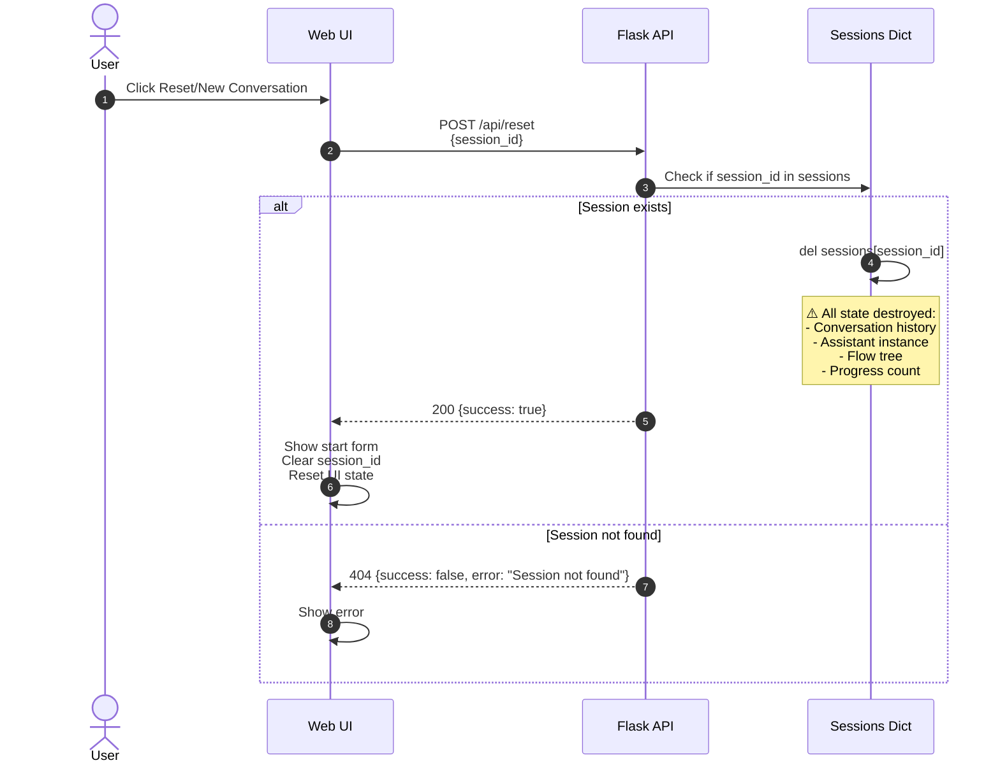

**Data Passed**:
- Step 2: `{session_id: str}` (HTTP POST)
- Step 5/7: JSON response

**Sync vs Async**: All **SYNC**

**Trigger Conditions**: User clicks reset button

---

### 2.4 Object Classification Flow (`/api/classify`)

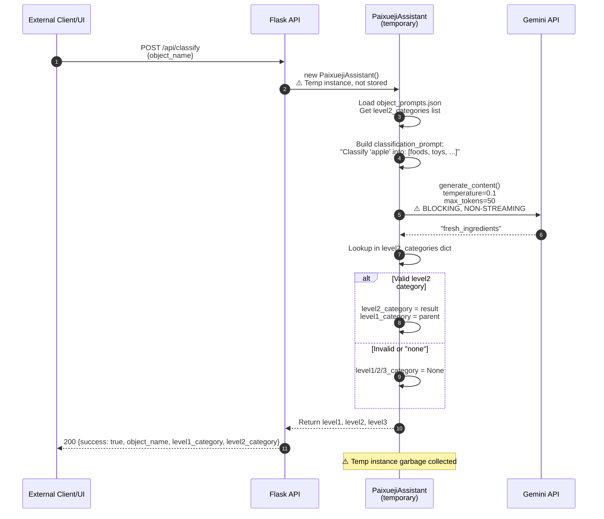

**Data Passed**:
- Step 1: `{object_name: str}`
- Step 4: Prompt with categories list
- Step 6: Category string response
- Step 10: JSON with categories

**Sync vs Async**: All **SYNC**

**Trigger Conditions**:
- Manual API call (not used in main UI flow)
- Background classification in `/api/force-switch` and `/api/select-object`

---

## 3. STATE & PERSISTENCE MAP

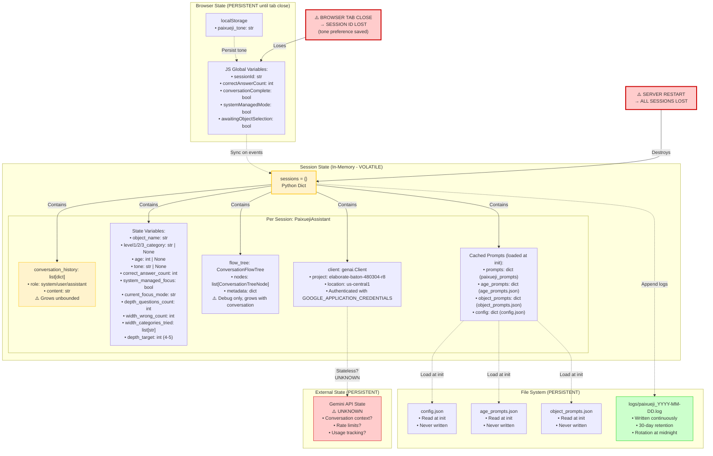

**State Mutation Points**:

1. **Session Creation** (`/api/start`):
   - `sessions[session_id] = new PaixuejiAssistant()`
   - All state variables initialized

2. **Conversation History Updates** (every LLM response):
   - `conversation_history.append({role: "assistant", content: response})`
   - ⚠️ **UNBOUNDED GROWTH** - no truncation or summary

3. **Correct Answer Increment** (`/api/continue` when correct):
   - `correct_answer_count++`

4. **Topic Switch** (when AI decides to switch):
   - `object_name = new_object`
   - `level1/2/3_category` updated via `classify_object_sync()`
   - `depth_questions_count = 0`
   - `width_wrong_count = 0`
   - `width_categories_tried = []`
   - `depth_target = random(4, 5)`

5. **Flow Tree Growth** (every turn):
   - `flow_tree.nodes.append(new_node)`
   - Each node contains: user_input, ai_response_part1, ai_response_part2, validation, decision, state snapshots
   - ⚠️ **UNBOUNDED GROWTH**

6. **Session Deletion** (`/api/reset`):
   - `del sessions[session_id]`
   - Python garbage collection handles cleanup

**Data Loss Scenarios**:
- Server restart/crash → all sessions lost
- Browser refresh → session_id lost (but server-side session remains orphaned)
- Network disconnect during stream → session remains, client loses connection
- Memory exhaustion from unbounded growth → potential crash

---

## 4. FAILURE & RETRY PATHS

```mermaid
graph TB
    subgraph "User Request Failures"
        InvalidInput["Invalid Input<br/>(missing object_name, age out of range)"]
        SessionNotFound["Session Not Found<br/>(404 error)"]
        NetworkError["Network Failure<br/>(client disconnect, timeout)"]
    end

    subgraph "LLM Call Failures"
        GeminiTimeout["Gemini API Timeout<br/>⚠️ NO TIMEOUT SET"]
        GeminiError["Gemini API Error<br/>(HTTP 500, rate limit, etc.)"]
        StreamInterrupt["Stream Interrupted<br/>(GeneratorExit)"]
        ValidationError["AI Validation JSON Parse Error"]
    end

    subgraph "System Failures"
        MemoryExhaustion["Memory Exhaustion<br/>(unbounded conversation history)"]
        LogDiskFull["Log Disk Full<br/>(30-day retention)"]
        ConfigLoadFail["Config File Load Failure<br/>(FileNotFoundError)"]
    end

    subgraph "Handling Strategies"
        ReturnError["Return HTTP Error<br/>400/404/500 + JSON message"]
        LogAndContinue["Log Error + Return Partial Response"]
        SafeDefault["Safe Default Values<br/>(is_engaged=true, is_correct=true)"]
        ClientAbort["Client Handles Abort<br/>(AbortController)"]
        YieldPartial["Yield Partial Response<br/>+ Empty final chunk"]
        FallbackNone["Fallback to None<br/>(categories, prompts)"]
    end

    %% Failure Paths
    InvalidInput -->|"Immediate validation"| ReturnError
    SessionNotFound -->|"Check sessions dict"| ReturnError
    NetworkError -->|"Flask/browser detect"| ClientAbort

    GeminiTimeout -->|"⚠️ HANGS FOREVER<br/>No timeout configured"| MemoryExhaustion
    GeminiError -->|"try/except in stream"| LogAndContinue
    GeminiError -->|"Final yield"| YieldPartial

    StreamInterrupt -->|"GeneratorExit caught"| LogAndContinue
    StreamInterrupt -.->|"Old stream continues in background"| MemoryExhaustion

    ValidationError -->|"JSON parse fail"| SafeDefault
    ValidationError -->|"traceback.print_exc()"| LogAndContinue

    ConfigLoadFail -->|"FileNotFoundError"| ReturnError

    LogDiskFull -.->|"Rotation fails"| MemoryExhaustion

    style GeminiTimeout fill:#ffcccc,stroke:#cc0000,stroke-width:3px
    style StreamInterrupt fill:#fff3cd,stroke:#ffc107,stroke-width:2px
    style MemoryExhaustion fill:#ffcccc,stroke:#cc0000,stroke-width:3px
    style SafeDefault fill:#e3f2fd,stroke:#2196f3
```

### Detailed Failure Scenarios

#### 4.1 Gemini API Failures

**Scenario**: `client.models.generate_content_stream()` throws exception

**Location**: `paixueji_stream.py` - all stream generators

**Handling**:
```python
try:
    stream = client.models.generate_content_stream(...)
    for chunk in stream:
        full_response += chunk.text
        yield (chunk.text, None, full_response)
except Exception as e:
    logger.error(f"LLM error | error={str(e)}", exc_info=True)
    if full_response:
        yield ("", token_usage, full_response)  # Return partial
    return
finally:
    if stream is not None:
        del stream  # Attempt cleanup
```

**Consequences**:
- Partial response returned to user
- Conversation history may be incomplete
- User sees partial message, no error indication in UI
- ⚠️ **NO RETRY** - single attempt only

**Trace Path**:
1. Exception in stream generator
2. Log to `logs/paixueji_YYYY-MM-DD.log` with traceback
3. Yield partial response (if any text received)
4. SSE stream completes normally
5. UI shows partial message

---

#### 4.2 AI Validation JSON Parse Failure

**Scenario**: `decide_topic_switch_with_validation()` returns invalid JSON

**Location**: `paixueji_stream.py:1038-1073`

**Handling**:
```python
try:
    response = client.models.generate_content(...)
    decision_data = json.loads(response.text)
    return decision_data
except Exception as e:
    logger.error(f"Validation error: {e}")
    return {
        'decision': 'CONTINUE',
        'new_object': None,
        'switching_reasoning': f'Error: {str(e)}',
        'is_engaged': True,  # Safe default
        'is_factually_correct': True,  # Safe default
        'correctness_reasoning': 'Could not evaluate due to error'
    }
```

**Consequences**:
- System assumes answer is correct and engaged
- No topic switching
- Conversation continues normally
- ⚠️ **SILENT FAILURE** - user not informed
- Incorrect answer may be celebrated as correct

**Trace Path**:
1. Gemini returns malformed JSON or non-JSON text
2. `json.loads()` raises exception
3. Log error with traceback
4. Return safe default decision
5. Continue with feedback generation path

---

#### 4.3 Stream Interruption (Client Disconnect)

**Scenario**: User clicks "Stop" button or closes tab during streaming

**Location**: `app.py:235-242`, `static/app.js:264-278`

**Handling (Backend)**:
```python
try:
    # ... streaming logic ...
except GeneratorExit:
    # Client disconnected
    print(f"[INFO] Session {session_id[:8]}... client disconnected")
```

**Handling (Frontend)**:
```javascript
function stopStreaming() {
    if (currentStreamController) {
        currentStreamController.abort();  // Abort fetch
        currentStreamController = null;
    }
    isStreaming = false;
    sendBtn.disabled = false;
}
```

**Consequences**:
- Backend: LLM stream continues in background thread until completion
- Backend: Conversation history is NOT updated (no final append)
- Frontend: Connection closed immediately
- ⚠️ **RESOURCE LEAK** - orphaned event loop and stream
- Session remains in `sessions` dict but in inconsistent state
- Next `/api/continue` will work but with incomplete history

**Trace Path**:
1. User clicks Stop → `AbortController.abort()`
2. Browser cancels SSE connection
3. Backend detects `GeneratorExit`
4. Backend logs disconnect message
5. Event loop thread continues running LLM call
6. Response lost, history not updated

---

#### 4.4 Session Not Found

**Scenario**: Client sends `/api/continue` with invalid or expired session_id

**Location**: `app.py:281-287`

**Handling**:
```python
assistant = sessions.get(session_id)
if not assistant:
    return jsonify({
        "success": False,
        "error": "Session not found. Please start a new conversation."
    }), 404
```

**Consequences**:
- User shown error message
- No state corruption
- User must restart conversation

**Trace Path**:
1. POST `/api/continue` with bad session_id
2. `sessions.get()` returns None
3. Return 404 JSON error
4. UI shows error alert
5. User clicks reset/start new

---

#### 4.5 Configuration File Missing

**Scenario**: `config.json` not found at startup

**Location**: `paixueji_assistant.py:100-108`

**Handling**:
```python
def _load_config(self, config_path):
    if not os.path.exists(config_path):
        raise FileNotFoundError(f"Config file not found: {config_path}")
    with open(config_path, 'r') as f:
        config = json.load(f)
    return config
```

**Consequences**:
- **FATAL ERROR** - server cannot start
- `PaixuejiAssistant.__init__()` raises exception
- Flask route handler crashes
- User sees HTTP 500 error
- ⚠️ **NO RECOVERY** - manual intervention required

**Trace Path**:
1. POST `/api/start`
2. `new PaixuejiAssistant()`
3. `_load_config()` raises `FileNotFoundError`
4. Flask returns 500 error
5. Frontend shows error message
6. Logs show traceback

---

#### 4.6 Memory Exhaustion (Unbounded Growth)

**Scenario**: Long conversation with many turns

**Location**:
- `paixueji_assistant.py` - `conversation_history` list
- `conversation_tree.py` - `flow_tree.nodes` list

**Handling**: ⚠️ **NONE** - no limits or cleanup

**Growth Rate**:
- `conversation_history`: ~1-2 KB per turn (user + assistant messages)
- `flow_tree.nodes`: ~2-5 KB per turn (full state snapshots)
- After 100 turns: ~300-700 KB per session
- After 1000 turns: ~3-7 MB per session

**Consequences**:
- Server slowdown as memory usage grows
- Potential OOM (Out of Memory) crash
- All sessions lost if server crashes
- ⚠️ **NO MONITORING** - no alerts or metrics

**Mitigation** (NOT IMPLEMENTED):
- Sliding window (keep last N messages)
- Conversation summary/compression
- Session timeout/expiry
- Memory usage alerts

---

### Retry Policies

**Current State**: ⚠️ **NO RETRIES IMPLEMENTED**

All external calls are single-attempt:
- Gemini API calls (streaming and non-streaming)
- Classification calls
- Validation calls

**Recommended** (not implemented):
- Exponential backoff for transient failures
- Circuit breaker for repeated failures
- Fallback to cached/default responses

---

### Timeout Policies

**Current State**: ⚠️ **NO TIMEOUTS CONFIGURED**

- Gemini streaming calls: **INFINITE TIMEOUT**
- Gemini validation calls: **INFINITE TIMEOUT**
- Classification calls: **1 SECOND** (via ThreadPoolExecutor in `/api/force-switch`)
- SSE connections: Browser default (~30-60s)

**Risks**:
- Hung requests can accumulate, exhausting threads
- User sees infinite loading state
- No automatic recovery

---

## 5. SECURITY BOUNDARIES & TRUST ZONES

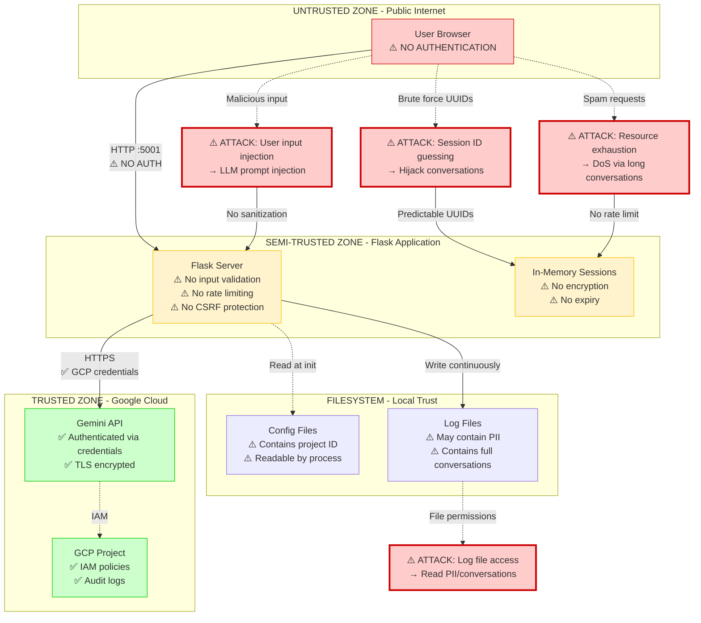

### Security Vulnerabilities

1. **No Authentication/Authorization**
   - Anyone can access any endpoint
   - Session IDs are UUIDs (somewhat random but predictable)
   - No user accounts or permissions

2. **Prompt Injection Risk**
   - User input passed directly to LLM prompts
   - No sanitization or escaping
   - Could manipulate AI behavior or extract system prompts

3. **No Rate Limiting**
   - Unlimited requests per client
   - Easy to exhaust memory via spam
   - No cost controls on Gemini API usage

4. **Session Hijacking**
   - Session IDs transmitted in plain JSON
   - No HTTPS enforcement (assumed but not configured)
   - No session expiry or rotation

5. **Log File PII Exposure**
   - Full conversations logged (may contain personal info)
   - Log files stored unencrypted
   - 30-day retention (compliance risk)

6. **No CORS Restrictions** (beyond flask-cors default)
   - Any origin can make requests
   - XSS/CSRF vulnerabilities possible

7. **Credential Exposure**
   - `GOOGLE_APPLICATION_CREDENTIALS` in environment
   - Config file contains project ID
   - No secrets management system

---

## 6. LOGGING, METRICS & MONITORING

### 6.1 Logging Architecture

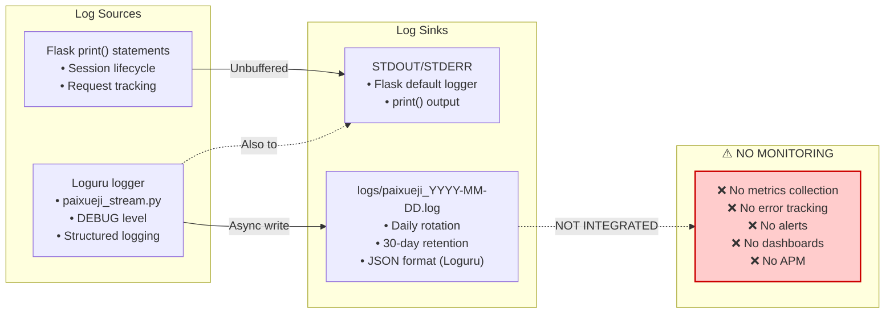

### 6.2 What IS Logged

**Flask Application (`app.py`)**:
- Session creation: session_id, age, object, categories, tone, focus_mode, request_id
- Session continue: session_id, answer preview, correct_count, focus_mode, request_id
- Session reset: session_id
- Classification requests: object_name, results
- Force switch: previous/new object
- Object selection: selected object
- Errors: exception messages, no tracebacks

**Streaming Engine (`paixueji_stream.py`)**:
- Function entry/exit: function name, parameters, duration
- LLM calls: model, message count, chunk count
- Validation decisions: decision type, reasoning, engagement, correctness
- Topic switches: previous/new object, reasoning
- Errors: full tracebacks with context
- Performance warnings: slow LLM calls (>5s threshold)

### 6.3 What is NOT Logged

❌ **Request metadata**: IP address, user agent, referer
❌ **Response sizes**: bytes transferred, chunk counts
❌ **Timing breakdown**: time per component (validation, response, question)
❌ **Resource usage**: memory, CPU, thread count
❌ **API costs**: Gemini token usage, API call costs
❌ **Error rates**: aggregated error statistics
❌ **User behavior**: interaction patterns, session duration

### 6.4 Observability Gaps

**No Distributed Tracing**:
- Cannot trace request across async boundaries
- request_id exists but not propagated to all logs

**No Metrics/Time Series**:
- No Prometheus/StatsD/CloudWatch
- Cannot graph trends over time
- No SLO/SLA tracking

**No Error Aggregation**:
- No Sentry/Rollbar/Bugsnag
- Errors only in log files
- No deduplication or grouping

**No Health Checks**:
- `/api/health` endpoint exists but only checks Flask is running
- Doesn't verify Gemini API connectivity
- Doesn't check memory usage or session count limits

---

## 7. EXTERNAL DEPENDENCIES

| Dependency | Type | Failure Mode | Impact | Mitigation |
|------------|------|--------------|--------|------------|
| **Google Gemini API** | Critical | API down, rate limit, timeout | Complete system failure | ⚠️ NONE - no fallback |
| **GCP Authentication** | Critical | Credentials expired, IAM policy change | Cannot authenticate to Gemini | ⚠️ NONE - no refresh logic |
| **Flask Server** | Critical | Process crash, OOM | All sessions lost | ⚠️ NONE - no persistence |
| **Python Libraries** | Critical | Import error, version mismatch | Server won't start | ⚠️ NONE - no version pinning |
| **Filesystem** | High | Disk full (logs), config file deleted | Logs fail, server won't start | Loguru rotation (logs only) |
| **Network** | High | Connectivity loss to GCP | Gemini calls hang/fail | ⚠️ NO TIMEOUT |
| **Browser EventSource** | Medium | Browser doesn't support SSE | UI won't work | Graceful degradation in JS |

### Dependency Versions (from requirements.txt)

```
flask         (version unknown - not pinned)
flask-cors    (version unknown - not pinned)
google-genai  (version unknown - not pinned)
requests      (version unknown - not pinned)
pydantic      (version unknown - not pinned)
loguru        (version unknown - not pinned)
```

⚠️ **NO VERSION PINNING** - risk of breaking changes on `pip install`

---

## 8. CONFIGURATION & SECRETS

### 8.1 Configuration Sources

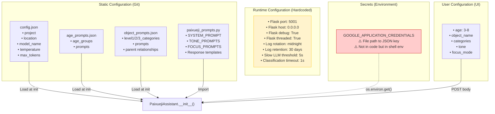

### 8.2 Secrets Management Issues

⚠️ **GOOGLE_APPLICATION_CREDENTIALS**:
- Expected in environment variable
- Points to JSON key file (not shown in repo)
- No validation if file exists or is valid
- No rotation mechanism
- ⚠️ If leaked, full GCP project access

⚠️ **Config in Git**:
- Project ID in `config.json` (publicly visible if repo public)
- Not a secret per se, but reveals GCP setup

⚠️ **No Secrets Rotation**:
- Manual process to update credentials
- Requires server restart
- No graceful reload

---

## 9. ASYNC BOUNDARIES & CONCURRENCY

### 9.1 Threading Model

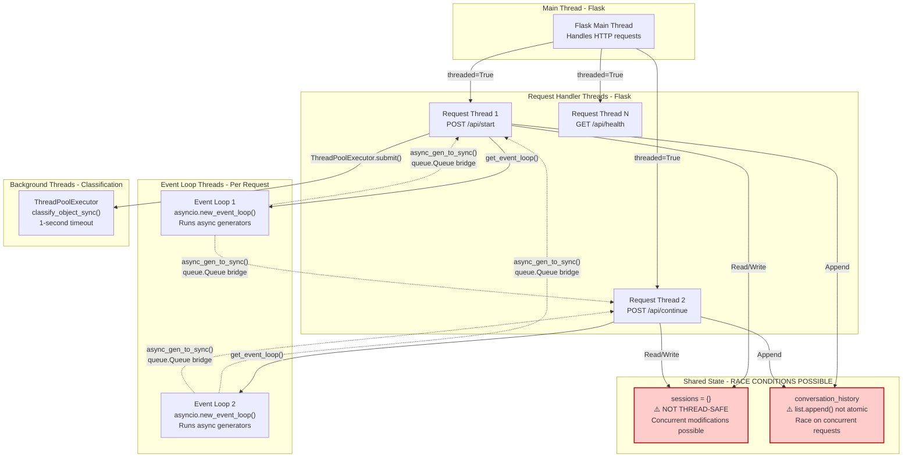

### 9.2 Race Conditions

**Scenario 1: Concurrent `/api/continue` requests**

User sends two messages rapidly before first response completes:

1. Request A: Validates answer, starts streaming Part 1
2. Request B: Validates same answer (duplicate), starts streaming Part 1
3. Both append to `conversation_history` in parallel
4. **Result**: Interleaved messages, corrupted history

**Mitigation**: ⚠️ **NONE** - UI disables send button during streaming, but not enforced server-side

**Scenario 2: Session deletion during streaming**

User clicks reset while `/api/continue` is streaming:

1. Request A: Streaming response from Gemini
2. Request B: `del sessions[session_id]`
3. Request A: Tries to append to `conversation_history`
4. **Result**: `AttributeError` if assistant object deleted mid-stream

**Mitigation**: ⚠️ **NONE** - exception would be caught and logged, partial response sent

**Scenario 3: Classification race**

Two requests trigger classification simultaneously:

1. Request A: `classify_object_sync("apple")`
2. Request B: `classify_object_sync("banana")`
3. Both update `assistant.level1/2/3_category`
4. **Result**: Categories may belong to wrong object

**Mitigation**: Classification runs in background thread with timeout, but no locking

### 9.3 Async Boundary Map

| Component | Sync/Async | Event Loop | Notes |
|-----------|------------|------------|-------|
| Flask request handlers | **SYNC** | None | Main thread pool |
| `get_event_loop()` | **SYNC** | Creates new loop | Per-request isolation |
| `async_gen_to_sync()` | **Bridge** | Runs loop in thread | queue.Queue for chunks |
| `call_paixueji_stream()` | **ASYNC** | Request event loop | Main orchestration |
| `ask_introduction_question_stream()` | **ASYNC** | Request event loop | Gemini streaming |
| `ask_followup_question_stream()` | **ASYNC** | Request event loop | Dual-parallel orchestration |
| `decide_topic_switch_with_validation()` | **SYNC** | None | Blocking Gemini call |
| `generate_feedback_response_stream()` | **ASYNC** | Request event loop | Part 1 streaming |
| `generate_followup_question_stream()` | **ASYNC** | Request event loop | Part 2 streaming |
| `classify_object_sync()` | **SYNC** | None | Background thread (1s timeout) |
| Gemini `generate_content_stream()` | **ASYNC** | Request event loop | External async iterator |
| Gemini `generate_content()` | **SYNC** | None | Blocking call |

---

## 10. DATA FLOW EXAMPLES

### 10.1 Example: User Answers Correctly

**Input**: Child answers "Red" to "What color is the apple?"

**Flow**:
```
POST /api/continue {session_id, child_input: "Red", focus_mode: "depth"}
  ↓
  sessions.get(session_id)  # Retrieve assistant
  ↓
  call_paixueji_stream(content="Red", ...)
  ↓
  ask_followup_question_stream(child_answer="Red", ...)
  ↓
  decide_topic_switch_with_validation(child_answer="Red", object="apple", ...)
  ↓
  [Gemini call] Analyze answer: engaged=true, correct=true, decision=CONTINUE
  ↓
  Return {is_engaged: true, is_factually_correct: true, decision: "CONTINUE"}
  ↓
  Route to: generate_feedback_response_stream()
  ↓
  [Gemini streaming] Build prompt: "Child answered 'Red' correctly about apple..."
  ↓
  Stream: "Yes! Red is a beautiful color for apples! Great job!"
  ↓
  conversation_history.append({role: assistant, content: "Yes! Red..."})
  ↓
  Route to: generate_followup_question_stream()
  ↓
  [Gemini streaming] Build prompt with focus_mode=depth
  ↓
  Stream: "Now, what shape is the apple?"
  ↓
  conversation_history.append({role: assistant, content: "Now, what shape..."})
  ↓
  correct_answer_count++  # 0 → 1
  ↓
  Yield final StreamChunk {finish: true, is_factually_correct: true, ...}
  ↓
  SSE: event: chunk, data: StreamChunk
  SSE: event: complete
  ↓
  UI: Update progress (1/∞), enable input
```

### 10.2 Example: User Says "I don't know"

**Input**: Child answers "idk" to "What color is the apple?"

**Flow**:
```
POST /api/continue {session_id, child_input: "idk", focus_mode: "depth"}
  ↓
  call_paixueji_stream(content="idk", ...)
  ↓
  decide_topic_switch_with_validation(child_answer="idk", ...)
  ↓
  [Gemini call] Analyze: engaged=false (stuck), correct=N/A, decision=CONTINUE
  ↓
  Return {is_engaged: false, is_factually_correct: false, decision: "CONTINUE"}
  ↓
  Route to: generate_explanation_response_stream()
  ↓
  [Gemini streaming] "You previously asked 'What color is the apple?'..."
  ↓
  Stream: "Apples can be red, green, or yellow! Many apples are red."
  ↓
  conversation_history.append({role: assistant, content: "Apples can be..."})
  ↓
  Route to: generate_followup_question_stream()
  ↓
  [Gemini streaming] Generate next depth question
  ↓
  Stream: "Can you show me with your hands how big an apple is?"
  ↓
  conversation_history.append({role: assistant, content: "Can you show me..."})
  ↓
  correct_answer_count UNCHANGED (0)
  ↓
  Yield final StreamChunk {finish: true, is_engaged: false, ...}
  ↓
  UI: Update progress (0/∞), enable input
```

### 10.3 Example: Topic Switch

**Input**: Child answers "Strawberry" to "Can you name another red fruit?"

**Flow**:
```
POST /api/continue {session_id, child_input: "Strawberry", focus_mode: "width_color"}
  ↓
  decide_topic_switch_with_validation(child_answer="Strawberry", object="apple", ...)
  ↓
  [Gemini call] Analyze:
    - engaged=true (real answer)
    - correct=true (strawberry is red fruit)
    - decision=SWITCH (invited object naming)
    - new_object="strawberry"
  ↓
  Return {is_engaged: true, is_factually_correct: true, decision: "SWITCH", new_object: "strawberry"}
  ↓
  assistant.object_name = "strawberry"
  ↓
  [Background thread] classify_object_sync("strawberry") with 1s timeout
  ↓
  assistant.level2_category = "fresh_ingredients" (or timeout → None)
  ↓
  Route to: generate_topic_switch_response_stream()
  ↓
  [Gemini streaming] "You were talking about apple, child mentioned strawberry..."
  ↓
  Stream: "Ooh, strawberries! I love strawberries too! Let's learn about them!"
  ↓
  conversation_history.append({role: assistant, content: "Ooh, strawberries!..."})
  ↓
  Route to: generate_followup_question_stream(is_topic_switch=true)
  ↓
  [Gemini streaming] First question about strawberry with depth focus
  ↓
  Stream: "What color are strawberries?"
  ↓
  conversation_history.append({role: assistant, content: "What color..."})
  ↓
  correct_answer_count++  # Strawberry answer was correct
  ↓
  Yield final StreamChunk {finish: true, new_object_name: "strawberry", ...}
  ↓
  UI: Update object display to "strawberry", enable input
```

---

## KNOWN UNKNOWNS

The following aspects are **UNKNOWN** or **underspecified** in the current implementation:

1. **Gemini API Internal State**:
   - Does Gemini maintain conversation context server-side?
   - How long are contexts cached?
   - What are the actual rate limits?
   - UNKNOWN

2. **Token Usage & Costs**:
   - Gemini streaming API doesn't return token usage
   - No cost tracking or budgeting
   - UNKNOWN total API costs per session

3. **Session Expiry**:
   - No TTL on sessions
   - Sessions never expire automatically
   - Orphaned sessions accumulate indefinitely
   - Memory usage over time: UNKNOWN

4. **Concurrent Request Limits**:
   - Flask threaded=True but no max threads configured
   - Default thread pool size: UNKNOWN
   - How many concurrent LLM calls can GCP handle: UNKNOWN

5. **Conversation History Growth**:
   - Maximum message count before performance degrades: UNKNOWN
   - Gemini context window limit: Assumed ~1M tokens but not enforced

6. **Classification Accuracy**:
   - Success rate of object → category classification: UNKNOWN
   - Fallback behavior when category is "none": Relies on default prompts

7. **Network Resilience**:
   - Timeout for Gemini API: UNKNOWN (none configured)
   - Retry behavior: None implemented
   - Behavior under high latency: UNKNOWN

8. **Browser Compatibility**:
   - SSE support: Assumed modern browsers
   - Tested browsers: UNKNOWN
   - Mobile browser behavior: UNKNOWN

9. **Error Rates**:
   - Frequency of Gemini API errors: UNKNOWN
   - Frequency of JSON parse errors in validation: UNKNOWN
   - User disconnect rate during streaming: UNKNOWN

10. **GCP Quotas**:
    - Gemini API quota limits: UNKNOWN
    - What happens when quota exceeded: UNKNOWN (assumes error returned)

---

## CRITICAL FINDINGS FOR DEBUGGING

### High-Severity Issues

1. **No timeout on Gemini calls** → Can hang indefinitely
2. **Unbounded conversation history** → Memory exhaustion risk
3. **No retry logic** → Single-point-of-failure for transient errors
4. **Race conditions on concurrent requests** → Data corruption possible
5. **No authentication** → Open to abuse
6. **Stream interruption leaves orphaned threads** → Resource leak
7. **No monitoring/alerting** → Failures go unnoticed

### Medium-Severity Issues

1. **Safe defaults on validation errors** → May celebrate wrong answers
2. **No session expiry** → Memory accumulation
3. **No version pinning** → Deployment instability
4. **Logs contain PII** → Compliance risk
5. **No rate limiting** → DoS vulnerability

### Design Decisions (By Intent)

1. **In-memory sessions** → Explicitly volatile (noted in code comments)
2. **Dual-parallel architecture** → Sequential (not concurrent) streaming
3. **Client-side stop button** → Frontend-only interrupt
4. **Topic switching** → AI-driven decision with manual override

---

**End of Operational Architecture Document**

Generated for debugging, tracing, and failure mode analysis.
Treat all ⚠️ warnings as potential bugs or areas requiring investigation.
